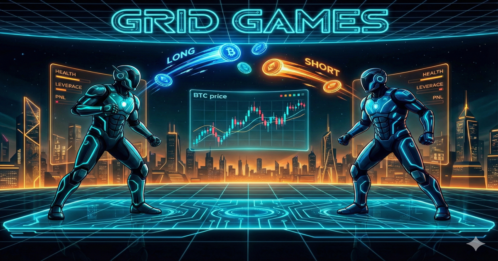

  

  # Grid Games

  **Two PvP trading games. One electric arena.**

  [Play Grid Games](https://gridgames.space/)

Grid Games is a fast, stylish head-to-head trading game experience built around pressure, timing,
and nerve.

Every match drops two players into the same live BTC battle. You are not just watching the market.
You are reacting to it in real time, pushing for better entries, protecting your balance, and
trying to outplay the person on the other side before the round ends.

## The Vibe

Grid Games is designed to feel sharp, futuristic, and a little dangerous.

The screens glow. The motion is fast. The tension builds quickly. Every choice feels immediate:
open now, wait one more second, close before the turn, press harder, or get punished.

It is part arcade duel, part trading faceoff, and part neon pressure chamber.

## Hyper Swiper

**Hyper Swiper** is the more frantic mode.

Coins fall through the arena and you swipe through them to open positions. It feels physical and
reactive, like reading a chart while playing an action game. You are watching price movement,
tracking your active trades, and making split-second calls while the screen keeps moving.

This mode is about speed, confidence, and committing at the right moment.

## Tap Dancer

**Tap Dancer** is cleaner, tighter, and more deliberate.

Instead of chasing falling coins, you tap directly into `LONG` and `SHORT` positions. The action
feels more controlled, but the pressure is still there. You are managing timing, rhythm, and risk
with less chaos on screen and more focus on decision-making.

It has a different energy from Hyper Swiper, but the same core thrill: beat your opponent by
reading the moment better.

## Why It Works

- It turns market movement into a direct two-player contest
- It gives each mode its own personality without losing the core tension
- It feels playful on the surface, but competitive underneath
- It is easy to understand and hard to master

## Play

[https://gridgames.space/](https://gridgames.space/)
