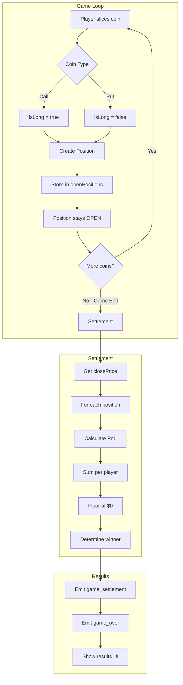

# Avantis Integration Alignment Plan

## Executive Summary

This plan outlines the alignment of Grid Games trading logic with Avantis Protocol SDK patterns. The goal is to prepare the codebase for future Avantis integration by adopting compatible data structures, terminology, and calculation methods.

**Key Principle**: Players slice coins to open positions throughout the game. ALL positions are settled at game end (no 5-second rule). Winner is determined by total realized PnL.

**Design Decisions**:

- ✅ Fixed $1 collateral per position
- ✅ Floor at $0 balance (no negative balances)
- ✅ No liquidation mechanics
- ✅ No 5-second settlement - all positions settle at game end

---

## Current State Analysis

### Current Terminology Mapping

| Current Term                | Avantis Equivalent         | Notes                   |
| --------------------------- | -------------------------- | ----------------------- |
| `coinType: 'call' \| 'put'` | `isLong: boolean`          | Direction of position   |
| `multiplier`                | `leverage: number`         | Leverage multiplier     |
| `priceAtOrder`              | `openPrice: number`        | Entry price             |
| `finalPrice`                | `closePrice: number`       | Exit price for PnL calc |
| `dollars`                   | `collateral + realizedPnl` | Total balance           |

### Current vs Proposed Architecture

```
┌─────────────────────────────────────────────────────────────────┐
│                    CURRENT GAME FLOW                             │
├─────────────────────────────────────────────────────────────────┤
│  1. Player slices coin (call/put)                               │
│  2. Order created with priceAtOrder                             │
│  3. Wait 5 seconds (ORDER_SETTLEMENT_DURATION_MS)               │
│  4. Compare finalPrice vs priceAtOrder                          │
│  5. Binary outcome: correct/incorrect                           │
│  6. Fixed amount transfer based on multiplier                   │
│  7. Winner = highest dollars balance                            │
└─────────────────────────────────────────────────────────────────┘

┌─────────────────────────────────────────────────────────────────┐
│                    NEW GAME FLOW (Avantis-Aligned)               │
├─────────────────────────────────────────────────────────────────┤
│  1. Player slices coin (call→LONG, put→SHORT)                   │
│  2. Position opened with openPrice, isLong, leverage            │
│  3. Position stays OPEN for duration of game                    │
│  4. Player can open multiple positions                          │
│  5. At GAME END:                                                │
│     a. Get final price (closePrice)                             │
│     b. Calculate PnL for each position                          │
│     c. Sum up realized PnL per player                           │
│     d. Winner = highest total balance                           │
└─────────────────────────────────────────────────────────────────┘
```

**Key Change**: No 5-second settlement. All positions settle at game end (2.5 minutes).

### Key Files to Modify

| File                                                                                                                 | Purpose                 | Changes Needed               |
| -------------------------------------------------------------------------------------------------------------------- | ----------------------- | ---------------------------- |
| [`frontend/game/types/trading.ts`](frontend/game/types/trading.ts)                                                   | Client type definitions | Add Position types           |
| [`frontend/app/api/socket/game-events-modules/types.ts`](frontend/app/api/socket/game-events-modules/types.ts)       | Server type definitions | Add Position types           |
| [`frontend/app/api/socket/game-events-modules/index.ts`](frontend/app/api/socket/game-events-modules/index.ts)       | Game loop & settlement  | Batch settlement at game end |
| [`frontend/app/api/socket/game-events-modules/GameRoom.ts`](frontend/app/api/socket/game-events-modules/GameRoom.ts) | Room state              | Store open positions         |
| [`frontend/game/stores/trading-store-modules/types.ts`](frontend/game/stores/trading-store-modules/types.ts)         | Store types             | Update state                 |
| [`frontend/components/PositionIndicator.tsx`](frontend/components/PositionIndicator.tsx)                             | UI display              | Show unrealized PnL          |

---

## Proposed Changes

### Phase 1: Type System Alignment

#### 1.1 New Position Interface

```typescript
// frontend/game/types/trading.ts

/**
 * Position direction - aligned with Avantis is_long
 * true = LONG (profit when price goes up)
 * false = SHORT (profit when price goes down)
 */
export type PositionDirection = boolean // isLong

/**
 * Position status
 * - OPEN: Position is active, waiting for game end
 * - SETTLED: Position closed at game end with realized PnL
 */
export type PositionStatus = 'open' | 'settled'

/**
 * Position - Aligned with Avantis TradeInput/TradeExtendedResponse
 * Represents a single trading position opened by slicing a coin
 *
 * Positions stay OPEN until game end, then all are settled at once.
 */
export interface Position {
  // Identity
  id: string // Unique position ID
  playerId: string // Player who opened the position
  playerName: string // Display name

  // Avantis-aligned fields
  pairIndex: number // Trading pair index (0 = BTC/USD)
  isLong: boolean // Direction: true=LONG, false=SHORT
  leverage: number // Leverage multiplier (2, 5, 10, 20)
  collateral: number // Fixed at $1 per position

  // Price tracking
  openPrice: number // Entry price (was priceAtOrder)
  closePrice: number | null // Exit price (set at game end)

  // PnL tracking (calculated at game end)
  realizedPnl: number // Realized PnL (0 until settled)

  // Timing
  openedAt: number // Timestamp when position opened
  settledAt: number | null // Game end timestamp
  status: PositionStatus // 'open' | 'settled'
}

/**
 * Position opened event - emitted when player slices a coin
 * Position stays open until game end
 */
export interface PositionOpenedEvent {
  positionId: string
  playerId: string
  playerName: string
  pairIndex: number
  isLong: boolean
  leverage: number
  collateral: number // Fixed at $1
  openPrice: number
}

/**
 * Game settlement event - emitted at game end with all position results
 */
export interface GameSettlementEvent {
  closePrice: number // Final BTC price at game end
  positions: Array<{
    positionId: string
    playerId: string
    playerName: string
    isLong: boolean
    leverage: number
    collateral: number
    openPrice: number
    closePrice: number
    realizedPnl: number // Calculated PnL
    isProfitable: boolean
  }>
  playerResults: Array<{
    playerId: string
    playerName: string
    totalPnl: number // Sum of all position PnLs
    finalBalance: number // Starting balance + totalPnl (floored at 0)
    positionCount: number
  }>
  winner: {
    playerId: string
    playerName: string
    winningBalance: number
  }
}
```

#### 1.2 Updated Player Interface

```typescript
// frontend/game/types/trading.ts

/**
 * Player state - Aligned with Avantis collateral model
 */
export interface Player {
  id: string
  name: string

  // Collateral tracking (Avantis-aligned)
  startingBalance: number // Starting collateral ($10)
  realizedPnl: number // Running total of realized PnL (updated at game end)

  // Position tracking
  openPositionIds: string[] // IDs of open positions

  // Scene dimensions (for coin spawning)
  sceneWidth: number
  sceneHeight: number

  // Settings
  leverage: number // Default leverage for new positions
}
```

---

### Phase 2: PnL Calculation

#### 2.1 Avantis-Aligned PnL Formula

```typescript
// frontend/game/stores/trading-store-modules/pnl-calculations.ts

/**
 * Calculate PnL for a position - Avantis formula
 *
 * For LONG positions:
 *   pnl = (closePrice - openPrice) / openPrice * collateral * leverage
 *
 * For SHORT positions:
 *   pnl = (openPrice - closePrice) / openPrice * collateral * leverage
 *
 * @returns Realized PnL in USDC (can be negative)
 */
export function calculatePnl(
  isLong: boolean,
  openPrice: number,
  closePrice: number,
  collateral: number, // Fixed at $1
  leverage: number
): number {
  const priceChangePercent = isLong
    ? (closePrice - openPrice) / openPrice
    : (openPrice - closePrice) / openPrice

  return priceChangePercent * collateral * leverage
}

/**
 * Calculate unrealized PnL at current price (for UI display during game)
 */
export function calculateUnrealizedPnl(position: Position, currentPrice: number): number {
  if (position.status !== 'open') return 0

  return calculatePnl(
    position.isLong,
    position.openPrice,
    currentPrice,
    position.collateral,
    position.leverage
  )
}

/**
 * Calculate total unrealized PnL for a player (for live leaderboard)
 */
export function calculateTotalUnrealizedPnl(positions: Position[], currentPrice: number): number {
  return positions
    .filter((p) => p.status === 'open')
    .reduce((sum, p) => sum + calculateUnrealizedPnl(p, currentPrice), 0)
}
```

#### 2.2 Game End Settlement Logic

```typescript
// frontend/app/api/socket/game-events-modules/index.ts

/**
 * Settle all open positions at game end
 * Called when game timer expires or knockout occurs
 */
function settleAllPositions(io: SocketIOServer, room: GameRoom): GameSettlementEvent {
  const closePrice = priceFeed.getLatestPrice()
  const positionResults: GameSettlementEvent['positions'] = []
  const playerTotals = new Map<
    string,
    {
      totalPnl: number
      positionCount: number
    }
  >()

  // Initialize player totals
  for (const [playerId] of room.players) {
    playerTotals.set(playerId, { totalPnl: 0, positionCount: 0 })
  }

  // Calculate PnL for each open position
  for (const [positionId, position] of room.openPositions) {
    const realizedPnl = calculatePnl(
      position.isLong,
      position.openPrice,
      closePrice,
      position.collateral, // $1
      position.leverage
    )

    positionResults.push({
      positionId,
      playerId: position.playerId,
      playerName: position.playerName,
      isLong: position.isLong,
      leverage: position.leverage,
      collateral: position.collateral,
      openPrice: position.openPrice,
      closePrice,
      realizedPnl,
      isProfitable: realizedPnl > 0,
    })

    // Accumulate player totals
    const current = playerTotals.get(position.playerId)!
    current.totalPnl += realizedPnl
    current.positionCount += 1
  }

  // Calculate final balances
  const playerResults: GameSettlementEvent['playerResults'] = []
  for (const [playerId, player] of room.players) {
    const totals = playerTotals.get(playerId)!
    const startingBalance = GAME_CONFIG.STARTING_CASH
    const finalBalance = Math.max(0, startingBalance + totals.totalPnl) // Floor at 0

    playerResults.push({
      playerId,
      playerName: player.name,
      totalPnl: totals.totalPnl,
      finalBalance,
      positionCount: totals.positionCount,
    })
  }

  // Determine winner (highest final balance)
  const winner = playerResults.reduce((a, b) => (a.finalBalance > b.finalBalance ? a : b))

  return {
    closePrice,
    positions: positionResults,
    playerResults,
    winner: {
      playerId: winner.playerId,
      playerName: winner.playerName,
      winningBalance: winner.finalBalance,
    },
  }
}

/**
 * End game and settle all positions
 */
function endGame(
  io: SocketIOServer,
  manager: RoomManager,
  room: GameRoom,
  reason: 'time_limit' | 'knockout' | 'forfeit'
): void {
  if (room.getIsClosing()) return
  room.setClosing()

  // Settle ALL positions at game end
  const settlement = settleAllPositions(io, room)

  // Emit settlement details first
  io.to(room.id).emit('game_settlement', settlement)

  // Then emit game over
  io.to(room.id).emit('game_over', {
    winnerId: settlement.winner.playerId,
    winnerName: settlement.winner.playerName,
    reason,
    playerResults: settlement.playerResults,
  })

  setTimeout(() => manager.deleteRoom(room.id), 1000)
  setTimeout(() => disconnectPriceFeedIfIdle(manager), 1100)
}
```

---

### Phase 3: GameRoom Changes

#### 3.1 Store Open Positions

```typescript
// frontend/app/api/socket/game-events-modules/GameRoom.ts

export class GameRoom {
  readonly id: string
  readonly players: Map<string, Player>
  readonly coins: Map<string, Coin>

  // NEW: Store open positions instead of pending orders
  readonly openPositions: Map<string, Position> // Was: pendingOrders

  // ... rest of class

  /**
   * Add a new open position when player slices a coin
   */
  addOpenPosition(position: Position): void {
    this.openPositions.set(position.id, position)

    // Track position in player object
    const player = this.players.get(position.playerId)
    if (player) {
      player.openPositionIds.push(position.id)
    }
  }

  /**
   * Get all open positions for a player
   */
  getOpenPositionsForPlayer(playerId: string): Position[] {
    return Array.from(this.openPositions.values()).filter((p) => p.playerId === playerId)
  }

  /**
   * Get total position count
   */
  getTotalOpenPositions(): number {
    return this.openPositions.size
  }
}
```

---

### Phase 4: Client Store Updates

#### 4.1 State Changes

```typescript
// frontend/game/stores/trading-store-modules/types.ts

export interface GameState {
  // Remove: activeOrders, pendingOrders
  // Add:
  openPositions: Map<string, Position> // All open positions
  settlementResult: GameSettlementEvent | null // Results at game end

  // Keep:
  tugOfWar: number
  toasts: Toast[]
  leverage: number
}
```

#### 4.2 Event Handlers

```typescript
// frontend/game/stores/trading-store-modules/index.ts

// Socket event handlers
socket.on('position_opened', (position: PositionOpenedEvent) => {
  const { openPositions } = get()
  const newPositions = new Map(openPositions)
  newPositions.set(position.positionId, {
    ...position,
    id: position.positionId,
    closePrice: null,
    realizedPnl: 0,
    openedAt: Date.now(),
    settledAt: null,
    status: 'open',
  })
  set({ openPositions: newPositions })
})

socket.on('game_settlement', (settlement: GameSettlementEvent) => {
  // Update all positions with settlement data
  const { openPositions } = get()
  const newPositions = new Map(openPositions)

  for (const pos of settlement.positions) {
    const position = newPositions.get(pos.positionId)
    if (position) {
      position.closePrice = pos.closePrice
      position.realizedPnl = pos.realizedPnl
      position.status = 'settled'
      position.settledAt = Date.now()
    }
  }

  set({
    openPositions: newPositions,
    settlementResult: settlement,
  })
})
```

---

## Data Flow Diagram



---

## Migration Strategy

### Step 1: Add New Types (Non-Breaking)

1. Add new types alongside existing ones
2. Create type aliases for backward compatibility

```typescript
// Backward compatibility aliases
export type CoinType = 'call' | 'put' // Keep for now, deprecated
export type OrderPlacedEvent = PositionOpenedEvent
export type SettlementEvent = GameSettlementEvent

// Conversion helpers
export function coinTypeToIsLong(coinType: CoinType): boolean {
  return coinType === 'call'
}

export function isLongToCoinType(isLong: boolean): CoinType {
  return isLong ? 'call' : 'put'
}
```

### Step 2: Update Server Logic

1. Replace `pendingOrders` with `openPositions` in GameRoom
2. Remove 5-second settlement timeout
3. Add batch settlement at game end

### Step 3: Update Client Store

1. Replace `activeOrders`/`pendingOrders` with `openPositions`
2. Add `settlementResult` state
3. Update event handlers

### Step 4: Update UI

1. PositionIndicator: Show unrealized PnL live
2. GameOverModal: Show settlement breakdown
3. GameHUD: Show projected balance

### Step 5: Remove Deprecated Code

1. Remove old types
2. Remove settlement timeout logic
3. Clean up conversion helpers

---

## Key Differences Summary

| Aspect         | Current                     | Avantis-Aligned                |
| -------------- | --------------------------- | ------------------------------ |
| **Direction**  | `coinType: 'call' \| 'put'` | `isLong: boolean`              |
| **Settlement** | 5 seconds after slice       | All at game end                |
| **PnL**        | Binary win/lose             | Calculated from price movement |
| **Collateral** | Implicit                    | Explicit $1 per position       |
| **Winner**     | Running balance             | Final balance after settlement |

---

## Files to Modify (Checkpoint)

### Server-Side

- [ ] [`frontend/app/api/socket/game-events-modules/types.ts`](frontend/app/api/socket/game-events-modules/types.ts) - Add Position types
- [ ] [`frontend/app/api/socket/game-events-modules/GameRoom.ts`](frontend/app/api/socket/game-events-modules/GameRoom.ts) - Store openPositions
- [ ] [`frontend/app/api/socket/game-events-modules/index.ts`](frontend/app/api/socket/game-events-modules/index.ts) - Batch settlement

### Client-Side

- [ ] [`frontend/game/types/trading.ts`](frontend/game/types/trading.ts) - Add Position types
- [ ] [`frontend/game/stores/trading-store-modules/types.ts`](frontend/game/stores/trading-store-modules/types.ts) - Update state types
- [ ] [`frontend/game/stores/trading-store-modules/index.ts`](frontend/game/stores/trading-store-modules/index.ts) - Update handlers
- [ ] [`frontend/game/stores/trading-store-modules/helpers.ts`](frontend/game/stores/trading-store-modules/helpers.ts) - Add PnL calculations

### UI Components

- [ ] [`frontend/components/PositionIndicator.tsx`](frontend/components/PositionIndicator.tsx) - Show unrealized PnL
- [ ] [`frontend/components/GameOverModal.tsx`](frontend/components/GameOverModal.tsx) - Show settlement details
- [ ] [`frontend/components/GameHUD.tsx`](frontend/components/GameHUD.tsx) - Update balance display

---

## Next Steps

1. ✅ Review and approve this plan
2. ⏳ Switch to Code mode for implementation
3. Implement in phases as outlined above
4. Test thoroughly before deploying
