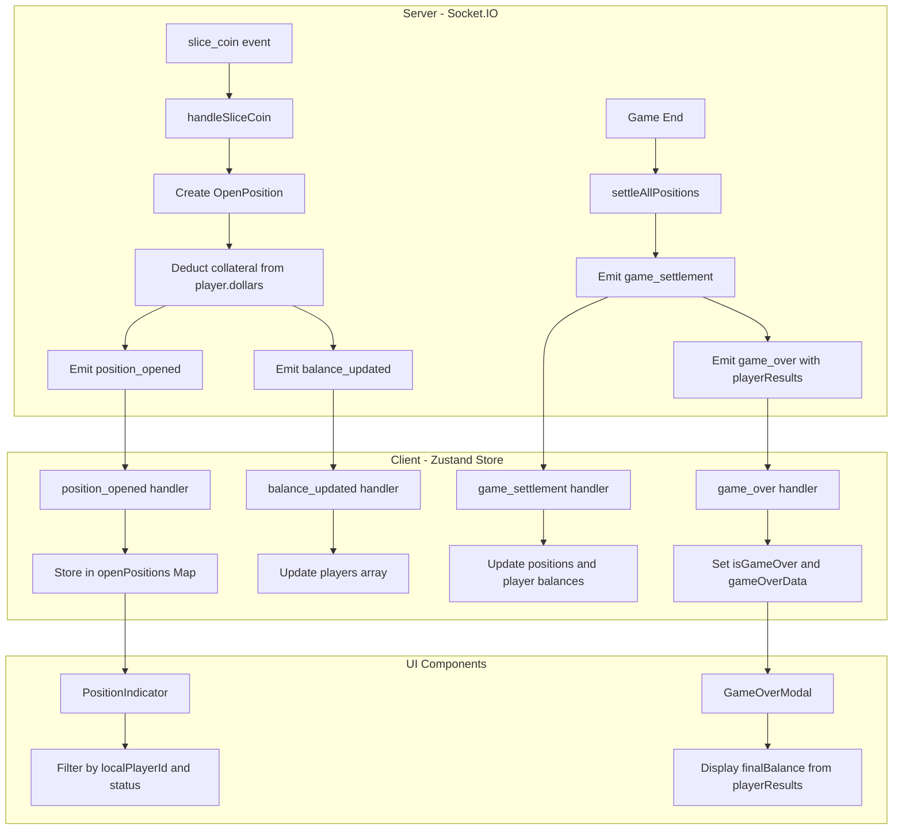

# Bug Fix Plan: Position Indicators, Balance Logic, and Game Over Modal

## Overview

This plan addresses three critical bugs in the HFT Battle game frontend:

1. **Missing Position Indicators** - Open positions are not rendering visually
2. **Balance & Collateral Logic** - Balance is hardcoded to $1 and not deducted on trade open
3. **Inaccurate Game Over Modal** - Displays static $10 instead of actual final balances

---

## Bug 1: Missing Position Indicators

### Problem Analysis

The [`PositionIndicator.tsx`](frontend/components/PositionIndicator.tsx) component is responsible for displaying open positions. **Confirmed: positions do not appear when coins are sliced.**

**Component Location**: Rendered in [`page.tsx`](frontend/app/page.tsx:59)

**Data Flow**:
1. Server creates position in [`game-events-modules/index.ts:523-548`](frontend/app/api/socket/game-events-modules/index.ts:523)
2. Emits `position_opened` event
3. Client stores in [`trading-store-modules/index.ts:506-525`](frontend/game/stores/trading-store-modules/index.ts:506) via `handlePositionOpened`
4. Component filters by `localPlayerId` and `status === 'open'`

**Possible Root Causes**:
1. **`localPlayerId` mismatch**: The selector at line 43 filters `position.playerId === state.localPlayerId`. If `localPlayerId` is `null` or uses a different ID format than the position's `playerId`, no positions render.
2. **Event not received**: The `position_opened` event may not be properly wired to `handlePositionOpened`
3. **Store not updating**: The `openPositions` Map may not be getting populated

### Solution

**Files to check/modify**:

1. [`frontend/components/PositionIndicator.tsx`](frontend/components/PositionIndicator.tsx) - Add debug logging
2. [`frontend/game/stores/trading-store-modules/index.ts`](frontend/game/stores/trading-store-modules/index.ts) - Verify event handler wiring

### Implementation Steps

#### Step 1: Add Debug Logging to Selector

```typescript
// In PositionIndicator.tsx - Add debug logging

const selectLocalOpenPositions = (state: TradingState) => {
  const playerId = state.localPlayerId
  const allPositions = Array.from(state.openPositions.values())
  
  // Debug: Log to verify data flow
  console.log('[PositionIndicator] All positions:', allPositions.length)
  console.log('[PositionIndicator] Local player ID:', playerId)
  console.log('[PositionIndicator] Position playerIds:', allPositions.map(p => p.playerId))
  
  return allPositions
    .filter((position) => position.playerId === playerId)
    .filter((position) => position.status === 'open')
    .sort((a, b) => a.openedAt - b.openedAt)
    .slice(0, 5)
}
```

#### Step 2: Verify Event Handler in Store

Check that `handlePositionOpened` is properly defined and wired to the socket event in [`trading-store-modules/index.ts`](frontend/game/stores/trading-store-modules/index.ts):

```typescript
// Verify this line exists in connect():
socket.on('position_opened', (position: PositionOpenedEvent) =>
  get().handlePositionOpened(position)
)

// And that handlePositionOpened properly updates the store:
handlePositionOpened: (position: PositionOpenedEvent) => {
  const { openPositions } = get()
  const newPositions = new Map(openPositions)
  newPositions.set(position.positionId, {
    id: position.positionId,
    playerId: position.playerId,
    // ... rest of position data
    status: 'open',
  })
  set({ openPositions: newPositions })
}
```

---

## Bug 2: Balance & Collateral Logic

### Problem Analysis

**Current Behavior**:
- Collateral is correctly set to `$1` per position (by design) at [`game-events-modules/index.ts:530`](frontend/app/api/socket/game-events-modules/index.ts:530)
- **BUG**: Balance is NOT deducted when position opens - player balance stays at $10 throughout the game
- Balance only updates at game end via `handleGameSettlement`

**Expected Behavior**:
- When a player opens a position, $1 should be deducted from their balance immediately as collateral
- This shows "locked" collateral during gameplay
- At game end, the PnL is applied to determine final balance
- Example: Player opens 3 positions → balance shows $7 (3×$1 collateral locked)

### Solution

**Files to Modify**:

1. **Server**: [`frontend/app/api/socket/game-events-modules/index.ts`](frontend/app/api/socket/game-events-modules/index.ts)
 - Deduct collateral from player balance when position is created
 - Emit balance update to client

2. **Client**: [`frontend/game/stores/trading-store-modules/index.ts`](frontend/game/stores/trading-store-modules/index.ts)
 - Add handler for balance updates during gameplay
 - Update `players` array with new balance

### Implementation Steps

#### Server-side (game-events-modules/index.ts)

```typescript
// In handleSliceCoin function, after creating openPosition:

// Deduct collateral from player balance
const player = room.players.get(playerId)
if (player) {
 player.dollars -= openPosition.collateral
 
 // Emit balance update
 io.to(room.id).emit('balance_updated', {
 playerId,
 newBalance: player.dollars,
 reason: 'position_opened',
 positionId: openPosition.id,
 collateral: openPosition.collateral,
 })
}
```

#### Client-side (trading-store-modules/index.ts)

```typescript
// Add new event listener in connect function:

socket.on('balance_updated', (data: BalanceUpdatedEvent) => {
 const { players } = get()
 const newPlayers = players.map((p) =>
 p.id === data.playerId ? { ...p, dollars: data.newBalance } : p
 )
 set({ players: newPlayers })
})
```

#### Type Definition (types/trading.ts)

```typescript
// Add new event type:

type BalanceUpdatedEvent = {
 playerId: string
 newBalance: number
 reason: 'position_opened' | 'position_closed'
 positionId?: string
 collateral?: number
}
```

---

## Bug 3: Inaccurate Game Over Modal

### Problem Analysis

**Current Code** at [`GameOverModal.tsx:40-41`](frontend/components/GameOverModal.tsx:40):
```typescript
const localPlayer = players.find((p) => p.id === localPlayerId)
const opponent = players.find((p) => p.id !== localPlayerId)
```

**Issue**: The modal reads from the `players` array which may not be updated with final balances yet.

**Server sends** at [`game-events-modules/index.ts:385-399`](frontend/app/api/socket/game-events-modules/index.ts:385):
```typescript
io.to(room.id).emit('game_over', {
 winnerId: settlement.winner.playerId,
 winnerName: settlement.winner.playerName,
 reason,
 playerResults: settlement.playerResults, // This contains final balances!
})
```

**Type Definition** at [`types/trading.ts:99-103`](frontend/game/types/trading.ts:99) is MISSING `playerResults`:
```typescript
type GameOverEvent = {
 winnerId: string
 winnerName: string
 reason?: 'time_limit' | 'knockout' | 'forfeit'
 // MISSING: playerResults!
}
```

### Root Cause

1. The `GameOverEvent` type doesn't include `playerResults`
2. The modal doesn't use `gameOverData.playerResults` for final balances
3. Race condition: `game_over` event may arrive before `game_settlement` updates the store

### Solution

**Files to Modify**:

1. [`frontend/game/types/trading.ts`](frontend/game/types/trading.ts) - Add `playerResults` to `GameOverEvent`
2. [`frontend/components/GameOverModal.tsx`](frontend/components/GameOverModal.tsx) - Use `gameOverData.playerResults` for final balances

### Implementation Steps

#### Type Definition Update (types/trading.ts)

```typescript
type GameOverEvent = {
 winnerId: string
 winnerName: string
 reason?: 'time_limit' | 'knockout' | 'forfeit'
 // Add player results for final balances
 playerResults?: PlayerSettlementResult[]
}
```

#### Modal Component Update (GameOverModal.tsx)

```typescript
// Replace lines 40-41 with:

// Prefer playerResults from gameOverData (authoritative), fallback to players array
const localPlayerResult = gameOverData.playerResults?.find(
 (r) => r.playerId === localPlayerId
)
const opponentResult = gameOverData.playerResults?.find(
 (r) => r.playerId !== localPlayerId
)

// Fallback to players array if playerResults not available
const localPlayer = players.find((p) => p.id === localPlayerId)
const opponent = players.find((p) => p.id !== localPlayerId)

// Use final balance from settlement results, or fallback to current dollars
const localFinalBalance = localPlayerResult?.finalBalance ?? localPlayer?.dollars ?? 0
const opponentFinalBalance = opponentResult?.finalBalance ?? opponent?.dollars ?? 0
```

Then update the display sections:
```typescript
// Line 153: Change from ${localPlayer?.dollars ?? 0} to:
${localFinalBalance}

// Line 216: Change from ${opponent?.dollars ?? 0} to:
${opponentFinalBalance}
```

---

## Architecture Diagram



---

## Files to Modify Summary

| File | Bug | Changes |
|------|-----|---------|
| [`frontend/components/PositionIndicator.tsx`](frontend/components/PositionIndicator.tsx) | 1 | Add null safety and debug logging |
| [`frontend/app/api/socket/game-events-modules/index.ts`](frontend/app/api/socket/game-events-modules/index.ts) | 2 | Deduct collateral, emit balance_updated |
| [`frontend/game/stores/trading-store-modules/index.ts`](frontend/game/stores/trading-store-modules/index.ts) | 2 | Add balance_updated event handler |
| [`frontend/game/types/trading.ts`](frontend/game/types/trading.ts) | 2, 3 | Add BalanceUpdatedEvent, update GameOverEvent |
| [`frontend/components/GameOverModal.tsx`](frontend/components/GameOverModal.tsx) | 3 | Use playerResults for final balances |

---

## Testing Checklist

### Bug 1 - Position Indicators
- [ ] Open a position by slicing a CALL/PUT coin
- [ ] Verify position appears in PositionIndicator component
- [ ] Verify PnL updates in real-time with price changes
- [ ] Verify position shows correct direction (LONG/SHORT) and leverage

### Bug 2 - Balance & Collateral
- [ ] Verify starting balance is $10
- [ ] Open a position and verify balance decreases by collateral amount
- [ ] Open multiple positions and verify cumulative deduction
- [ ] Verify balance updates in GameHUD health display

### Bug 3 - Game Over Modal
- [ ] Play a complete game
- [ ] Verify modal shows correct final balances for both players
- [ ] Verify winner is displayed correctly
- [ ] Verify balances match the actual game outcome
