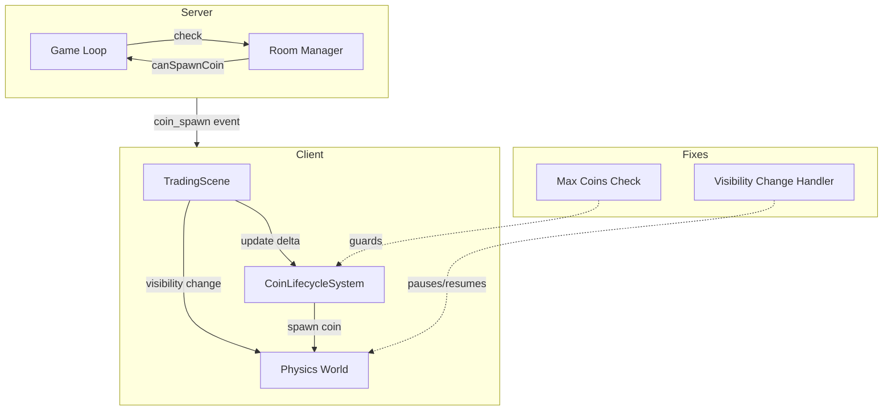

# Coin Physics Bug Fix Plan

## Problem Summary

Two issues have been identified:

1. **Coin Physics Speed Fluctuation**: Coins speed up and slow down when clicking on the canvas and clicking out
2. **Max Coins Rule Not Honored**: More than 3 coins can appear on screen at a time

---

## Issue 1: Coin Physics Speed Fluctuation

### Root Cause Analysis

The physics speed fluctuation occurs due to **missing visibility change handling** in the current TradingScene implementation. When a user clicks outside the canvas or the browser tab loses focus:

1. **Phaser's game loop continues running** but may accumulate time
2. **Physics world doesn't pause** when the tab is hidden
3. When focus returns, the accumulated delta time causes a "catch-up" effect where physics appears to speed up

### Evidence

In [`frontend/domains/hyper-swiper/client/phaser/scenes/TradingScene.ts`](frontend/domains/hyper-swiper/client/phaser/scenes/TradingScene.ts:1), there is **no visibility change handler**:

```typescript
// Current implementation - NO visibility handling
export class TradingScene extends Scene {
  // ... no visibilityChangeHandler
}
```

However, the search results show a reference to visibility handling that exists in another version:
```typescript
this.visibilityChangeHandler = () => {
  if (document.hidden) {
    this.physics.world.pause()
  } else {
    this.physics.world.resume()
  }
}
```

This handler is **missing** from the current implementation.

### Additional Contributing Factors

1. **Delta Time Clamping** in [`TradingScene.update()`](frontend/domains/hyper-swiper/client/phaser/scenes/TradingScene.ts:61):
   ```typescript
   const clampedDelta = Math.max(4, Math.min(50, delta))
   ```
   - This clamps delta to 4-50ms range
   - When focus returns after a long pause, large delta values are clamped to 50ms
   - This can cause physics to appear slower initially, then normalize

2. **Fixed Step Physics** in [`frontend/domains/hyper-swiper/client/phaser/config.ts`](frontend/domains/hyper-swiper/client/phaser/config.ts:105):
   ```typescript
   physics: {
     arcade: {
       fps: 60,
       fixedStep: true,
       timeScale: 1,
     },
   }
   ```
   - Fixed step physics should provide consistent behavior
   - But without pause/resume on visibility change, accumulated time causes issues

### Solution

Add visibility change handling to [`TradingScene.ts`](frontend/domains/hyper-swiper/client/phaser/scenes/TradingScene.ts):

```typescript
export class TradingScene extends Scene {
  private services: TradingSceneServices
  private eventEmitter: Phaser.Events.EventEmitter
  private visibilityChangeHandler: () => void  // ADD THIS

  constructor() {
    super({ key: 'TradingScene' })
    this.eventEmitter = new Phaser.Events.EventEmitter()
    this.services = new TradingSceneServices(this)
    this.visibilityChangeHandler = this.handleVisibilityChange.bind(this)  // ADD THIS
  }

  create(): void {
    // ... existing code ...

    // ADD visibility change listener
    document.addEventListener('visibilitychange', this.visibilityChangeHandler)
  }

  // ADD this method
  private handleVisibilityChange(): void {
    if (document.hidden) {
      // Pause physics when tab is hidden to prevent time accumulation
      this.physics.world.pause()
    } else {
      // Resume physics when tab becomes visible again
      this.physics.world.resume()
    }
  }

  shutdown(): void {
    // Remove visibility listener
    document.removeEventListener('visibilitychange', this.visibilityChangeHandler)
    
    // ... existing shutdown code ...
  }
}
```

---

## Issue 2: Max Coins Rule Not Honored

### Root Cause Analysis

The max coins rule is enforced **server-side** but **NOT client-side**:

1. **Server-side enforcement** in [`frontend/app/api/socket/multiplayer/room.manager.ts:279`](frontend/app/api/socket/multiplayer/room.manager.ts:279):
   ```typescript
   canSpawnCoin(): boolean {
     return this.activeCoins.size < CFG.MAX_ACTIVE_COINS  // MAX_ACTIVE_COINS = 3
   }
   ```

2. **Client-side handling** in [`frontend/domains/hyper-swiper/client/phaser/systems/CoinLifecycleSystem.ts:56`](frontend/domains/hyper-swiper/client/phaser/systems/CoinLifecycleSystem.ts:56):
   ```typescript
   handleCoinSpawn(data: CoinSpawnEvent): void {
     if (!this.tokenPool) return
     // NO CHECK FOR MAX COINS HERE!
     // Directly spawns coin without checking active count
   }
   ```

### Why This Causes Issues

1. **Race conditions**: Multiple coin spawn events can arrive before the server updates its count
2. **Network latency**: Server state and client state can be out of sync
3. **No client-side limit**: Client blindly spawns any coin it receives

### Evidence from Search Results

The search found a reference to client-side enforcement that should exist:
```typescript
if (activeCoins >= MAX_ACTIVE_COINS) {
  console.warn(
    `[CoinLifecycle] Max coins (${MAX_ACTIVE_COINS}) reached, ignoring spawn event for coin ${data.coinId}`
  )
  return
}
```

But this check is **NOT present** in the current [`CoinLifecycleSystem.handleCoinSpawn()`](frontend/domains/hyper-swiper/client/phaser/systems/CoinLifecycleSystem.ts:56).

### Solution

Add client-side max coins check to [`CoinLifecycleSystem.ts`](frontend/domains/hyper-swiper/client/phaser/systems/CoinLifecycleSystem.ts):

```typescript
// Add constant at top of file
const MAX_ACTIVE_COINS = 3

export class CoinLifecycleSystem {
  // ... existing code ...

  handleCoinSpawn(data: CoinSpawnEvent): void {
    if (!this.tokenPool) return

    // ADD: Count active coins
    const activeCoins = this.tokenPool.getChildren().filter(
      (token) => (token as Token).active
    ).length

    // ADD: Enforce max coins limit
    if (activeCoins >= MAX_ACTIVE_COINS) {
      console.warn(
        `[CoinLifecycle] Max coins (${MAX_ACTIVE_COINS}) reached, ignoring spawn event for coin ${data.coinId}`
      )
      return
    }

    // ... rest of existing spawn logic ...
  }
}
```

---

## Implementation Checklist

### Phase 1: Fix Physics Timing Issue

- [ ] Add `visibilityChangeHandler` property to TradingScene class
- [ ] Add `handleVisibilityChange()` method to pause/resume physics world
- [ ] Register visibility change listener in `create()`
- [ ] Remove visibility change listener in `shutdown()`

### Phase 2: Fix Max Coins Enforcement

- [ ] Add `MAX_ACTIVE_COINS` constant to CoinLifecycleSystem
- [ ] Count active coins at the start of `handleCoinSpawn()`
- [ ] Add guard clause to return early if max coins reached
- [ ] Add warning log for debugging

### Phase 3: Testing

- [ ] Test clicking in/out of canvas - coins should maintain consistent speed
- [ ] Test tab switching - physics should pause and resume cleanly
- [ ] Test coin spawning - should never exceed 3 coins on screen
- [ ] Test rapid spawn events - client should drop excess spawns

---

## Files to Modify

| File | Changes |
|------|---------|
| [`frontend/domains/hyper-swiper/client/phaser/scenes/TradingScene.ts`](frontend/domains/hyper-swiper/client/phaser/scenes/TradingScene.ts) | Add visibility change handling |
| [`frontend/domains/hyper-swiper/client/phaser/systems/CoinLifecycleSystem.ts`](frontend/domains/hyper-swiper/client/phaser/systems/CoinLifecycleSystem.ts) | Add max coins client-side check |

---

## Architecture Diagram



---

## Risk Assessment

| Risk | Impact | Mitigation |
|------|--------|------------|
| Physics pause affects game fairness | Medium | Both players should experience same pause behavior |
| Dropped coin spawns desync game | Low | Server is authoritative; client dropping is safe |
| Memory leak from event listeners | Low | Proper cleanup in shutdown() |

---

## Estimated Complexity

- **Physics Fix**: Low complexity - standard visibility handling pattern
- **Max Coins Fix**: Low complexity - simple guard clause addition
