# Coin Physics Manual Delta Implementation Plan

## Problem Statement

The coins in Hyper-Swiper experience speed fluctuations while the chevron animation (SnakePriceGraph) is extremely smooth. The goal is to make coin movement as smooth as the chevron by implementing manual delta-based movement.

---

## Root Cause Analysis

### Why Chevron is Smooth (SnakePriceGraph)

```typescript
// Exponential smoothing - frame independent
const t = 1 - Math.pow(0.5, delta / Math.max(1, CONFIG.priceHalfLifeMs))
this.currentDisplayedPrice += (targetPrice - this.currentDisplayedPrice) * t

// Position from timestamp - no accumulator
const x = headX - (now - p.time) * effectiveSpd
```

**Key factors:**
1. Uses raw `delta` directly in calculations
2. No reliance on physics engine accumulator
3. Position calculated from `Date.now()` timestamps
4. Frame-independent exponential smoothing

### Why Coins Are Less Smooth (Token)

```typescript
// Current: Uses Phaser Arcade Physics
this.body.setVelocity(velocityX, velocityY)
this.body.setGravity(0, 180)
```

**Key factors:**
1. Physics engine uses time accumulator
2. When frames are missed, physics "catches up" with multiple steps
3. Tab focus changes cause accumulated physics debt
4. Speed appears to burst when returning from unfocused state

---

## All Factors Affecting Coin Speed

### Factor 1: Physics Engine Accumulator (Primary)

**Location:** Phaser's internal Arcade Physics World
**Issue:** Fixed timestep physics accumulates time when frames are slow/missed
**Solution:** Replace with manual delta movement

### Factor 2: Delta Not Passed to CoinLifecycleSystem

**Location:** `TradingSceneServices.ts` line 69
```typescript
update(delta: number): void {
  // ... 
  this.coinLifecycle.update()  // Delta not passed!
}
```

**Issue:** The clamped delta from TradingScene is not passed to coin updates
**Solution:** Pass delta through the entire update chain

### Factor 3: No Delta Clamping in Manual Movement

**Location:** `Token.ts` (if implementing manual delta)
**Issue:** Large delta spikes (e.g., 200ms) could cause coins to jump
**Solution:** Clamp delta to reasonable range (16-33ms) for movement calculations

### Factor 4: Tween Animations on Same Object

**Location:** `Token.ts` spawn and breathing tweens
```typescript
this.scene.tweens.add({
  targets: this,
  scale: targetScale * 1.03,
  // ...
})
```

**Issue:** Tweens modify `scale` while physics might be running
**Impact:** Low - scale tweens don't affect position
**Note:** Rotation tween affects `angle` which is separate from physics

### Factor 5: Group Pool Configuration

**Location:** `CoinLifecycleSystem.ts` line 26-36
```typescript
this.tokenPool = this.scene.add.group({
  classType: Token,
  runChildUpdate: true,  // Token's preUpdate called automatically
  // ...
})
```

**Issue:** `runChildUpdate: true` means Token's `preUpdate` is called by Phaser
**Impact:** If we implement `preUpdate` for manual movement, it will be called automatically
**Solution:** Either use `preUpdate` or explicit update call, not both

### Factor 6: Physics Body Sync for Collisions

**Location:** Collision detection requires accurate body position
**Issue:** Manual position updates must sync to physics body
**Solution:** After updating `x, y`, sync to body:
```typescript
if (this.body) {
  this.body.position.x = this.x - this.body.width / 2
  this.body.position.y = this.y - this.body.height / 2
}
```

### Factor 7: Server-Side Velocity Values

**Location:** `CoinSpawnEvent` from server
```typescript
type CoinSpawnEvent = {
  velocityX: number
  velocityY: number
  // ...
}
```

**Issue:** Velocities are defined server-side in pixels per second
**Impact:** None - these are just initial values, client handles movement
**Note:** Ensure manual delta uses same velocity units (px/s)

---

## Implementation Plan

### Step 1: Modify Token.ts - Add Manual Movement Properties

```typescript
export class Token extends GameObjects.Container {
  // Add manual physics properties
  private velocityX: number = 0
  private velocityY: number = 0
  private gravity: number = 180  // px/s²
  private angularVelocity: number = 0  // deg/s
  
  // ... existing code
}
```

### Step 2: Modify Token.spawn() - Disable Physics Velocity

```typescript
spawn(
  x: number,
  y: number,
  type: CoinType,
  id: string,
  config: CoinConfig,
  isMobile: boolean,
  velocityX: number = 0,
  velocityY: number = 0
): void {
  // Store velocities for manual movement
  this.velocityX = velocityX
  this.velocityY = velocityY
  this.gravity = 180  // Can be parameterized
  this.angularVelocity = type === 'long' ? 60 : -60
  
  // ... existing setup code ...
  
  // Physics body for collisions ONLY, not movement
  if (!this.body) {
    this.scene.physics.add.existing(this)
  }
  this.body.reset(x, y)
  
  // DISABLE physics-driven movement
  this.body.setVelocity(0, 0)
  this.body.setGravity(0, 0)
  this.body.setAngularVelocity(0)
  this.body.setDrag(0, 0)
  
  // ... rest of spawn code ...
}
```

### Step 3: Add Token.preUpdate() for Manual Delta Movement

```typescript
preUpdate(_time: number, delta: number): void {
  if (!this.active) return
  
  // Clamp delta to prevent large jumps (16ms to 50ms range)
  const clampedDelta = Math.max(4, Math.min(50, delta))
  const deltaSeconds = clampedDelta / 1000
  
  // Apply gravity to velocity (px/s² * s = px/s)
  this.velocityY += this.gravity * deltaSeconds
  
  // Apply velocity to position (px/s * s = px)
  this.x += this.velocityX * deltaSeconds
  this.y += this.velocityY * deltaSeconds
  
  // Apply angular velocity (deg/s * s = deg)
  this.angle += this.angularVelocity * deltaSeconds
  
  // Sync physics body for collision detection
  if (this.body) {
    this.body.position.x = this.x - this.body.width / 2
    this.body.position.y = this.y - this.body.height / 2
  }
}
```

### Step 4: Update Token.onSlice() - Reset Manual Velocities

```typescript
onSlice(): void {
  this.cleanupTweens()
  
  this.setActive(false)
  this.setVisible(false)
  
  // Reset manual velocities
  this.velocityX = 0
  this.velocityY = 0
  this.angularVelocity = 0
  
  // Hide ambient glow
  if (this.glowGraphics) {
    this.glowGraphics.setVisible(false)
  }
  
  // Also reset physics body
  if (this.body) {
    this.body.stop()
    this.body.setVelocity(0, 0)
  }
}
```

### Step 5: Update CoinLifecycleSystem - Remove Manual Update Call

Since `runChildUpdate: true` is set on the group, Token's `preUpdate` will be called automatically by Phaser. The current `updateCoinPhysics()` only handles spatial grid updates and coin removal.

```typescript
update(): void {
  // preUpdate is called automatically by Phaser via runChildUpdate
  // Only handle spatial grid and cleanup here
  this.updateCoinPhysics()
}
```

### Step 6: Verify Delta Clamping in TradingScene

The clamped delta from TradingScene should be used consistently:

```typescript
// TradingScene.ts
update(_time: number, delta: number): void {
  // Clamp delta to 4-50ms range to prevent physics spikes
  const clampedDelta = Math.max(4, Math.min(50, delta))
  this.services.update(clampedDelta)
}
```

**Note:** Since we're using `preUpdate` with Phaser's automatic calling, the delta passed there is the raw frame delta, not the clamped one. We should clamp inside `preUpdate` as shown in Step 3.

---

## Files to Modify

| File | Changes |
|------|---------|
| `frontend/domains/hyper-swiper/client/phaser/objects/Token.ts` | Add manual physics properties, implement preUpdate, modify spawn/onSlice |
| `frontend/domains/hyper-swiper/client/phaser/systems/CoinLifecycleSystem.ts` | Verify update chain, may need minor adjustments |

---

## Testing Checklist

1. [ ] Coins move at consistent speed regardless of frame rate
2. [ ] Coins maintain speed when clicking outside browser/canvas
3. [ ] Coins maintain speed when swiping rapidly
4. [ ] Collision detection still works (slicing coins)
5. [ ] Coin spawn animation still plays correctly
6. [ ] Coin breathing animation still works
7. [ ] Coins fall off screen and are properly cleaned up
8. [ ] No console errors related to physics body

---

## Architecture Diagram

```mermaid
flowchart TD
    subgraph Current[Current Implementation]
        A1[TradingScene.update] -->|delta| B1[TradingSceneServices.update]
        B1 --> C1[CoinLifecycleSystem.update]
        C1 --> D1[updateCoinPhysics - spatial grid only]
        A1 --> E1[Phaser Game Loop]
        E1 --> F1[Physics World.update]
        F1 --> G1[Body velocity updates position]
        G1 --> H1[Token.x/y changes]
    end
    
    subgraph Proposed[Proposed Implementation]
        A2[TradingScene.update] -->|clamped delta| B2[TradingSceneServices.update]
        B2 --> C2[CoinLifecycleSystem.update]
        C2 --> D2[updateCoinPhysics - spatial grid only]
        A2 --> E2[Phaser Game Loop]
        E2 --> F2[Update List calls preUpdate]
        F2 --> G2[Token.preUpdate - manual delta movement]
        G2 --> H2[velocity += gravity * dt]
        H2 --> I2[position += velocity * dt]
        I2 --> J2[Sync body for collisions]
    end
```



---

## Expected Outcome

After implementing manual delta movement:

1. **Consistent Speed:** Coins move at the same speed regardless of frame rate
2. **No Speed Bursts:** Returning from unfocused tab doesn't cause speed-up
3. **Smooth Movement:** Matches the smoothness of the chevron animation
4. **Collision Detection:** Still works via synced physics body
5. **Deterministic:** Same input produces same visual result

---

## References

- Phaser Documentation: `preUpdate(time, delta)` is the recommended way to handle frame-independent updates
- SnakePriceGraph: Already uses delta-based exponential smoothing successfully
- Token.ts: Already has structure for manual properties, just needs activation
