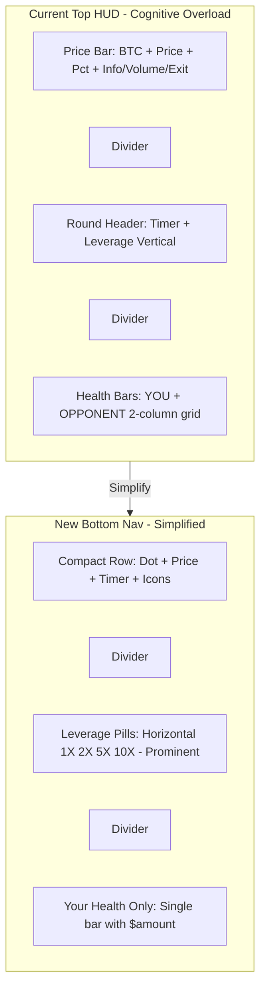

# GameHUD Bottom Navigation Redesign - Implementation Plan

## Executive Summary

This plan addresses the redesign of the GameHUD component to move from a top-positioned layout to a mobile-first bottom navigation pattern. The redesign focuses on **reducing cognitive load** and **encouraging fast decisions** by simplifying the UI.

### Key Design Principles (from Base Mini App Guidelines)

- **Optimize for thumb reach and one-handed use**
- **Keep core actions visible** - not hidden behind scrolls
- **Limit the number of buttons** - make it obvious what users should do first
- **Touch targets at least 44px**
- **Use Inter font** for readability
- **4px base spacing** for mobile granularity

### Design Decisions

1. **Remove opponent health entirely** - Users focus only on their own stats, reducing cognitive load
2. **No pre-game leverage selection** - Leverage selection stays in-game only for fast matchmaking
3. **Prominent in-game leverage selector** - Easy to change during gameplay with thumb-friendly pills

## Current State Analysis

### File Structure

```
frontend/components/
├── GameHUD.tsx                    # Main HUD component (top-positioned)
├── MatchmakingScreen.tsx          # Pre-game matchmaking (unchanged)
└── GameHUD-modules/
    ├── index.ts                   # Module exports
    ├── RoundHeader.tsx            # Timer + LeverageSelector wrapper
    ├── LeverageSelector.tsx       # 4 pill buttons (1X, 2X, 5X, 10X)
    ├── PlayerHealthBar.tsx        # Player name, health bar, dollars
    ├── ConnectionStatusDot.tsx    # WebSocket connection indicator
    ├── PriceLoadingState.tsx      # Loading placeholder
    └── types.ts                   # Shared types and helpers

frontend/game/stores/
└── trading-store-modules/
    └── index.ts                   # findMatch/joinWaitingPool with hardcoded leverage: 2
```

### Current Issues

1. **Positioning**: HUD at top creates thumb strain on mobile
2. **Cognitive Overload**: Showing both players' health adds unnecessary information
3. **Complex Layout**: Multiple sections with dividers, verbose labels
4. **Mobile UX**: Not following mini app bottom navigation patterns

## Target Architecture

### New Component Structure

```
frontend/components/
├── GameHUD.tsx                    # Bottom-positioned HUD (simplified)
├── MatchmakingScreen.tsx          # Unchanged (no leverage selection)
└── GameHUD-modules/
    ├── index.ts                   # Updated exports
    ├── CompactPriceRow.tsx        # NEW: Price + Timer + Actions in one row
    ├── LeverageSelector.tsx       # Horizontal pills (prominent, thumb-friendly)
    ├── PlayerHealthBar.tsx        # SIMPLIFIED: Only user's health (remove opponent)
    ├── ConnectionStatusDot.tsx    # Unchanged
    ├── PriceLoadingState.tsx      # Unchanged
    └── types.ts                   # Unchanged
```

### Layout Transformation



### Key Simplifications

| Element           | Before         | After          | Rationale                                       |
| ----------------- | -------------- | -------------- | ----------------------------------------------- |
| Opponent Health   | Shown          | **Removed**    | Reduce cognitive load, focus on user's own game |
| Pre-game Leverage | Planned        | **Skipped**    | Fast matchmaking, set leverage in-game          |
| Health Bar Layout | 2-column grid  | Single row     | Cleaner, less visual noise                      |
| Leverage Pills    | Vertical stack | Horizontal row | Thumb-friendly, always visible                  |

## Implementation Steps

### Step 1: Update GameHUD Positioning

**File**: [`frontend/components/GameHUD.tsx`](frontend/components/GameHUD.tsx)

**Changes**:

- Line 145: Change `absolute top-0` → `fixed bottom-0`
- Line 145: Change `z-10` → `z-30`
- Line 145: Update padding `p-1.5 sm:p-2 lg:p-3` → `px-3 pt-3 pb-safe pb-6`
- Line 152: Change `rounded-xl` → `rounded-t-xl`
- Lines 68-142: Remove or simplify the price loading overlay

**Key Code Change**:

```tsx
// Before
<motion.div
  className="absolute top-0 left-0 right-0 z-10 p-1.5 sm:p-2 lg:p-3 pointer-events-none"
  ...
>

// After
<motion.div
  className="fixed bottom-0 left-0 right-0 z-30 px-3 pt-3 pb-safe pb-6 pointer-events-none"
  ...
>
  <div className="glass-panel-vibrant rounded-t-xl overflow-hidden">
```

### Step 2: Create CompactPriceRow Component

**File**: `frontend/components/GameHUD-modules/CompactPriceRow.tsx` (NEW)

**Purpose**: Combine price display, timer, and action buttons into a single compact row.

**Props Interface**:

```tsx
interface CompactPriceRowProps {
  priceData: PriceData | null
  selectedCrypto: CryptoSymbol
  isPriceConnected: boolean
  priceError: string | null
  gameTimeRemaining: number
  isSoundMuted: boolean
  onToggleSound: () => void
  onShowHowToPlay: () => void
  onEndGame: () => void
  isGameReady: boolean
}
```

**Layout**:

```
[●] [BTC $94,123.45 +2.34%] [1:23] [?] [🔊] [✕]
 │        │                    │     │   │   │
 │        │                    │     │   │   └─ Exit (conditional)
 │        │                    │     │   └───── Volume toggle
 │        │                    │     └───────── How to play
 │        │                    └───────────────── Timer
 │        └────────────────────────────────────── Price display
 └─────────────────────────────────────────────── Connection dot
```

### Step 3: Convert LeverageSelector to Horizontal Pills

**File**: [`frontend/components/GameHUD-modules/LeverageSelector.tsx`](frontend/components/GameHUD-modules/LeverageSelector.tsx)

**Current State**: Vertical stacking with descriptive labels and risk dots

**Changes**:

- Line 86: Change `flex-col` → `flex-row` (already horizontal, but verify)
- Line 97: Reduce padding `px-2 sm:px-3 py-1.5 sm:py-2` → `px-3 py-2`
- Lines 127-137: Remove risk indicator dot (redundant with color)
- Add `compact` prop for bottom nav mode

**Key Code Change**:

```tsx
// Simplified pill without risk dot
<motion.button
  className={cn(
    'px-3 py-2 rounded-lg font-black text-sm tracking-wider',
    'border transition-all duration-200 min-w-[44px] min-h-[44px]'
    // ... color classes
  )}
>
  <span>{option.label}</span>
  {/* Remove risk indicator dot */}
</motion.button>
```

### Step 4: Simplify PlayerHealthBar (Remove Opponent)

**File**: [`frontend/components/GameHUD-modules/PlayerHealthBar.tsx`](frontend/components/GameHUD-modules/PlayerHealthBar.tsx)

**Rationale**: Remove opponent health entirely to reduce cognitive load. Users focus on their own game and make faster decisions.

**Changes**:

1. **Remove opponent health display** - Only show local player's health
2. **Simplify to single bar layout** - No grid, just one centered health bar
3. **Remove "YOU"/"OPP" badges** - No longer needed with single player display
4. **Reduce height**: `h-3 sm:h-4` → `h-2.5`
5. **Keep dollar amount prominent**: `text-sm sm:text-base font-bold`

**New Layout**:

```tsx
// Before: 2-column grid with both players
<div className="grid grid-cols-2 gap-2 sm:gap-3">
  <PlayerHealthBar player={localPlayer} label="YOU" />
  <PlayerHealthBar player={opponent} label="OPP" />
</div>

// After: Single centered health bar (local player only)
<div className="flex justify-center">
  <div className="w-full max-w-xs">
    <div className="flex items-center justify-between mb-1">
      <span className="text-[10px] text-tron-cyan tracking-wider">YOUR CASH</span>
      <span className="text-sm font-bold text-white">${dollars}</span>
    </div>
    <div className="h-2.5 bg-black/80 rounded-full overflow-hidden border border-white/20">
      <motion.div className="h-full rounded-full bg-gradient-to-r from-emerald-500 to-green-400"
        animate={{ width: `${healthPercent * 100}%` }}
      />
    </div>
  </div>
</div>
```

**GameHUD.tsx Change**:

```tsx
// Before: Render both players
{
  getPlayerSlots(localPlayer, opponent).map(
    (slot, index) => slot.player && <PlayerHealthBar key={slot.player.id} {...slot} />
  )
}

// After: Only local player
{
  localPlayer && (
    <div className="p-2 sm:p-3">
      <SinglePlayerHealth dollars={localPlayer.dollars} />
    </div>
  )
}
```

### Step 5: Add CSS Utilities

> **Note:** Pre-game leverage selection is intentionally skipped to enable fast matchmaking.
> Users can easily set leverage during gameplay with the prominent in-game selector.

**File**: `frontend/app/globals.css`

**Add to end of file**:

```css
/* Bottom navigation safe area for iOS */
.pb-safe {
  padding-bottom: env(safe-area-inset-bottom, 0px);
}

/* Inter font override for numeric values */
.font-numeric {
  font-family: 'Inter var', system-ui, sans-serif;
  font-variant-numeric: tabular-nums;
}

/* Ensure bottom nav doesn't block game input */
.bottom-nav-container {
  pointer-events: none;
}

.bottom-nav-container > * {
  pointer-events: auto;
}
```

### Step 8: Remove RoundHeader (Integrate into CompactPriceRow)

**File**: [`frontend/components/GameHUD-modules/RoundHeader.tsx`](frontend/components/GameHUD-modules/RoundHeader.tsx)

**Action**: This file can be removed after integrating its functionality into CompactPriceRow.

**Integration**:

- Timer logic moves to CompactPriceRow
- LeverageSelector becomes standalone below price row

### Step 9: Update Module Exports

**File**: [`frontend/components/GameHUD-modules/index.ts`](frontend/components/GameHUD-modules/index.ts)

**Changes**:

```tsx
// Re-export all GameHUD components
export { ConnectionStatusDot } from './ConnectionStatusDot'
export { PlayerHealthBar } from './PlayerHealthBar'
export { CompactPriceRow } from './CompactPriceRow'  // NEW
export { PriceLoadingState } from './PriceLoadingState'
export { LeverageSelector } from './LeverageSelector'
// Remove: export { RoundHeader } from './RoundHeader'

// Re-export types and helpers (unchanged)
export { ... } from './types'
```

## Design Specifications

### Spacing (4px Base Unit)

| Element           | Mobile                      | Desktop          |
| ----------------- | --------------------------- | ---------------- |
| Container padding | `px-3 pt-3 pb-6`            | `px-4 pt-4 pb-8` |
| Section gap       | `gap-2` (8px)               | `gap-3` (12px)   |
| Button padding    | `px-3 py-2`                 | `px-4 py-2`      |
| Touch targets     | `min-w-[44px] min-h-[44px]` | Same             |

### Typography Scale

| Element        | Mobile                | Desktop                 |
| -------------- | --------------------- | ----------------------- |
| Price          | `text-lg font-bold`   | `text-2xl font-bold`    |
| Timer          | `text-sm font-medium` | `text-base font-medium` |
| Leverage pills | `text-sm font-black`  | `text-sm font-black`    |
| Player names   | `text-[9px]`          | `text-xs`               |
| Dollar amounts | `text-[10px]`         | `text-xs`               |

### Color Palette (Existing)

```css
--tron-cyan: #00f3ff /* Primary */ --green-400: #4ade80 /* Success/2X */ --yellow-400: #facc15
  /* Warning/5X */ --red-400: #f87171 /* Danger/10X */ --tron-orange: #ff6b00 /* Muted/Exit */;
```

## Verification Checklist

### Visual Testing

- [ ] Mobile (375px): All elements visible, touch targets 44x44px
- [ ] Tablet (768px): Appropriate spacing scaling
- [ ] Desktop (1440px): Full layout with larger text
- [ ] iOS Safe Area: Bottom padding accounts for home indicator
- [ ] **Single health bar** - Only user's health displayed, opponent removed

### Functional Testing

- [ ] **In-game leverage changes** work smoothly (no pre-game selection)
- [ ] Leverage changes sync to opponent via WebSocket
- [ ] All buttons (info, volume, exit) remain functional
- [ ] Price feed loading state displays correctly
- [ ] Timer countdown visible and accurate
- [ ] **Fast matchmaking** - No leverage step before matching

### Technical Testing

- [ ] `bun run types` passes without errors
- [ ] `bun run format` applied to all modified files
- [ ] `bun run lint` passes without warnings
- [ ] No console errors in browser

## Risk Mitigation

### Z-Index Conflicts

- Current modal z-index: `z-50`
- New HUD z-index: `z-30`
- Game canvas: `z-0` to `z-10`
- **Mitigation**: Verify modals still appear above HUD

### PositionIndicator Overlap

- PositionIndicator currently at bottom
- **Mitigation**: May need to adjust PositionIndicator offset or hide during gameplay

### Phaser Canvas Input

- HUD overlay could block game touch events
- **Mitigation**: Use `pointer-events-none` on container, `pointer-events-auto` on interactive elements

### Cognitive Load (Addressed)

- **Issue**: Showing opponent health adds unnecessary information
- **Solution**: Removed opponent health entirely - users focus on their own game
- **Benefit**: Faster decision-making, cleaner UI

## Files Modified Summary

| File                                   | Type       | Changes                                     |
| -------------------------------------- | ---------- | ------------------------------------------- |
| `GameHUD.tsx`                          | Modify     | Bottom positioning, remove opponent health  |
| `GameHUD-modules/CompactPriceRow.tsx`  | **NEW**    | Combined price + timer row                  |
| `GameHUD-modules/LeverageSelector.tsx` | Modify     | Prominent horizontal pills, remove risk dot |
| `GameHUD-modules/PlayerHealthBar.tsx`  | Modify     | **Simplified to single player only**        |
| `GameHUD-modules/RoundHeader.tsx`      | **DELETE** | Integrated into CompactPriceRow             |
| `GameHUD-modules/index.ts`             | Modify     | Update exports                              |
| `app/globals.css`                      | Modify     | Add CSS utilities                           |

> **Note:** MatchmakingScreen.tsx and trading-store are NOT modified.
> Pre-game leverage selection is skipped for fast matchmaking.
> Users set leverage easily during gameplay.

## Estimated Impact

- **Lines Changed**: ~300 lines across 6 files (reduced from 9)
- **New Files**: 1 (`CompactPriceRow.tsx`)
- **Deleted Files**: 1 (`RoundHeader.tsx`)
- **Complexity**: Medium (layout restructure, simplify health bar)
- **Testing Required**: Visual regression, functional testing

## Implementation Order

1. **Step 1**: Add CSS utilities (safe area, font-numeric)
2. **Step 2**: Create CompactPriceRow component
3. **Step 3**: Update LeverageSelector (horizontal, prominent)
4. **Step 4**: Simplify PlayerHealthBar (single player only)
5. **Step 5**: Update GameHUD (bottom positioning, integrate components)
6. **Step 6**: Update module exports
7. **Step 7**: Delete RoundHeader.tsx
8. **Step 8**: Test and verify

## Next Steps

1. Review and approve this simplified plan
2. Switch to Code mode for implementation
3. Implement steps sequentially
4. Run verification checklist after each major change
5. Final visual and functional testing
