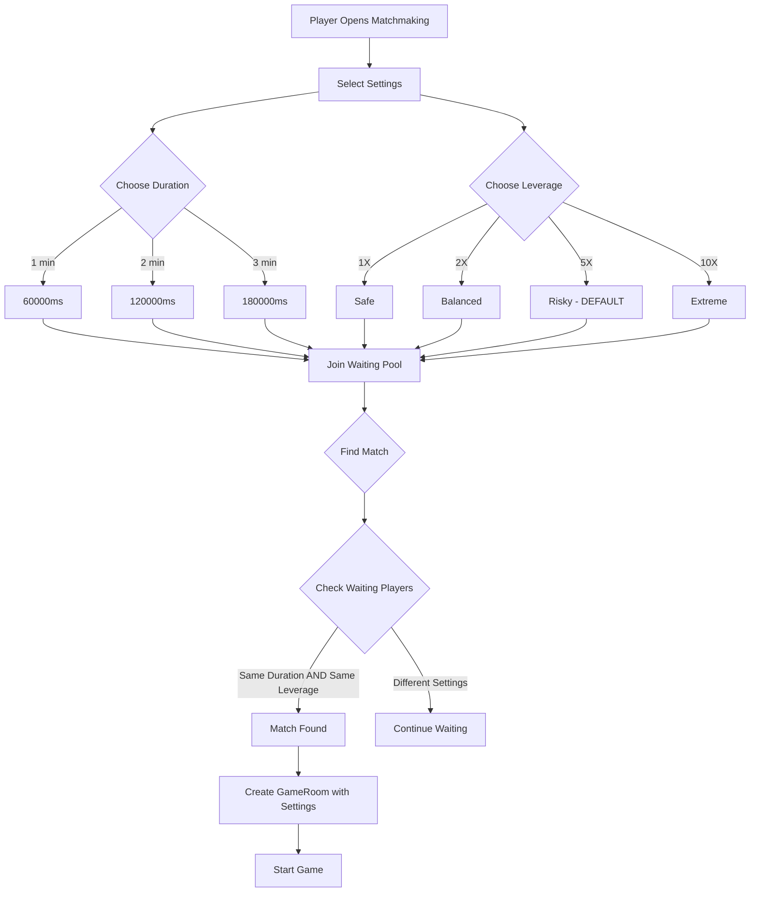

# Matchmaking Settings Plan

## Overview

Move leverage selection from in-game HUD to pre-game matchmaking screen, add game duration selection, and ensure matchmaking pairs players with similar settings.

## Current State Analysis

### Leverage System
- **Component**: [`LeverageSelector.tsx`](frontend/games/hyper-swiper/components/GameHUD-modules/LeverageSelector.tsx)
- **Current Location**: In-game HUD at bottom of screen
- **Default**: 2x leverage
- **Options**: 1x, 2x, 5x, 10x

### Game Duration
- **Location**: Hardcoded in [`constants.ts`](frontend/games/hyper-swiper/game/constants.ts)
- **Current Value**: 150000ms (2.5 minutes)

### Matchmaking
- Already supports leverage-based matching in [`game-events-modules/index.ts`](frontend/app/api/socket/game-events-modules/index.ts:577)
- Players with different leverage settings are NOT matched together

## Proposed Changes

### 1. Remove LeverageSelector from GameHUD

**File**: [`GameHUD.tsx`](frontend/games/hyper-swiper/components/GameHUD.tsx)

Remove:
- Import of `LeverageSelector` from GameHUD-modules
- The `<LeverageSelector />` component render at line 141
- Associated divider at lines 143-150

### 2. Add GameSettings Section to MatchmakingScreen

**File**: [`MatchmakingScreen.tsx`](frontend/games/hyper-swiper/components/MatchmakingScreen.tsx)

Add a new settings section between the title and auth buttons with:

```
┌─────────────────────────────────────┐
│         GAME SETTINGS               │
├─────────────────────────────────────┤
│  DURATION                           │
│  [1 MIN] [2 MIN] [3 MIN]            │
├─────────────────────────────────────┤
│  LEVERAGE                           │
│  [1X]  [2X]  [5X]  [10X]            │
└─────────────────────────────────────┘
```

**Default Values**:
- Duration: 1 minute (60000ms)
- Leverage: 5x

### 3. Update Trading Store

**File**: [`trading-store-modules/index.ts`](frontend/games/hyper-swiper/game/stores/trading-store-modules/index.ts)

Add new state:
```typescript
// Game settings for matchmaking
selectedGameDuration: 60000, // Default 1 minute
selectedLeverage: 5, // Default 5x
```

Add actions:
```typescript
setSelectedGameDuration: (duration: number) => void
setSelectedLeverage: (leverage: number) => void
```

Update `findMatch` to pass selected settings:
```typescript
findMatch: (playerName: string, walletAddress?: string) => {
  const { selectedGameDuration, selectedLeverage } = get()
  socket?.emit('find_match', {
    playerName,
    sceneWidth,
    sceneHeight,
    walletAddress,
    leverage: selectedLeverage,
    gameDuration: selectedGameDuration,
  })
}
```

Update `joinWaitingPool` to include settings:
```typescript
joinWaitingPool: (playerName: string, walletAddress: string, gameDuration: number, leverage: number) => void
```

### 4. Update Server-Side Matchmaking

**File**: [`game-events-modules/index.ts`](frontend/app/api/socket/game-events-modules/index.ts)

Update `find_match` handler:
- Add `gameDuration` to the received parameters
- Match players only if BOTH leverage AND gameDuration match

```typescript
// In find_match handler
if (waiting.leverage !== p1Leverage) continue
if (waiting.gameDuration !== p1GameDuration) continue // NEW
```

**File**: [`RoomManager.ts`](frontend/app/api/socket/game-events-modules/RoomManager.ts)

Update `addWaitingPlayer`:
```typescript
addWaitingPlayer(
  socketId: string, 
  name: string, 
  leverage: number = 2,
  gameDuration: number = 60000 // NEW
): void
```

**File**: [`types.ts`](frontend/app/api/socket/game-events-modules/types.ts)

Update `WaitingPlayer` interface:
```typescript
interface WaitingPlayer {
  name: string
  socketId: string
  joinedAt: number
  leverage: number
  gameDuration: number // NEW
}
```

### 5. Update GameRoom for Dynamic Duration

**File**: [`GameRoom.ts`](frontend/app/api/socket/game-events-modules/GameRoom.ts)

Make game duration configurable:
```typescript
// Change from readonly to mutable
GAME_DURATION: number // Instead of readonly

constructor(roomId: string, gameDuration: number = 60000) {
  this.id = roomId
  this.GAME_DURATION = gameDuration
  // ...
}
```

### 6. Update Types

**File**: [`types.ts`](frontend/games/hyper-swiper/game/types/trading.ts)

Update `LobbyPlayer` interface to include game settings for display:
```typescript
interface LobbyPlayer {
  socketId: string
  name: string
  joinedAt: number
  leverage: number
  gameDuration: number // NEW
}
```

## Implementation Order

1. **Phase 1 - Types and Store** (Foundation)
   - Update types in `types.ts` files
   - Add state and actions to trading store
   - Update `WaitingPlayer` type

2. **Phase 2 - Server-Side** (Backend)
   - Update `RoomManager.ts` for duration in waiting pool
   - Update matchmaking logic in `game-events-modules/index.ts`
   - Update `GameRoom.ts` for dynamic duration

3. **Phase 3 - UI** (Frontend)
   - Remove `LeverageSelector` from `GameHUD.tsx`
   - Create `GameSettingsSelector` component for `MatchmakingScreen.tsx`
   - Update `MatchmakingScreen.tsx` to use new settings

4. **Phase 4 - Integration**
   - Update `findMatch` and `joinWaitingPool` calls
   - Test matchmaking with different settings

## UI Component Design

### GameSettingsSelector Component

```tsx
// Time options
const TIME_OPTIONS = [
  { value: 60000, label: '1 MIN' },
  { value: 120000, label: '2 MIN' },
  { value: 180000, label: '3 MIN' },
]

// Leverage options (reuse existing pattern)
const LEVERAGE_OPTIONS = [
  { value: 1, color: 'cyan', label: '1X' },
  { value: 2, color: 'green', label: '2X' },
  { value: 5, color: 'yellow', label: '5X' },
  { value: 10, color: 'red', label: '10X' },
]
```

### Visual Design
- Glass panel styling matching existing UI
- Animated selection indicators
- Color-coded leverage buttons (existing pattern)
- Clean grid layout for options

## Matchmaking Flow Diagram



## Questions for Clarification

1. **Time Options**: Should we offer 1min, 2min, 3min as options, or different values?

2. **Leverage Options**: Keep existing 1x, 2x, 5x, 10x or modify?

3. **Display in Lobby**: Should the opponent list show each player's selected settings so users can choose opponents with matching preferences?

4. **Settings Persistence**: Should we remember the player's last selected settings (localStorage)?

## Files to Modify

| File | Changes |
|------|---------|
| `frontend/games/hyper-swiper/components/GameHUD.tsx` | Remove LeverageSelector import and usage |
| `frontend/games/hyper-swiper/components/MatchmakingScreen.tsx` | Add GameSettingsSelector section |
| `frontend/games/hyper-swiper/game/stores/trading-store-modules/index.ts` | Add duration/leverage state, update findMatch/joinWaitingPool |
| `frontend/games/hyper-swiper/game/stores/trading-store-modules/types.ts` | Add new state types |
| `frontend/games/hyper-swiper/game/types/trading.ts` | Update LobbyPlayer type |
| `frontend/app/api/socket/game-events-modules/index.ts` | Update matchmaking to match duration |
| `frontend/app/api/socket/game-events-modules/RoomManager.ts` | Add duration to waiting player |
| `frontend/app/api/socket/game-events-modules/GameRoom.ts` | Make duration configurable |
| `frontend/app/api/socket/game-events-modules/types.ts` | Add gameDuration to WaitingPlayer |
