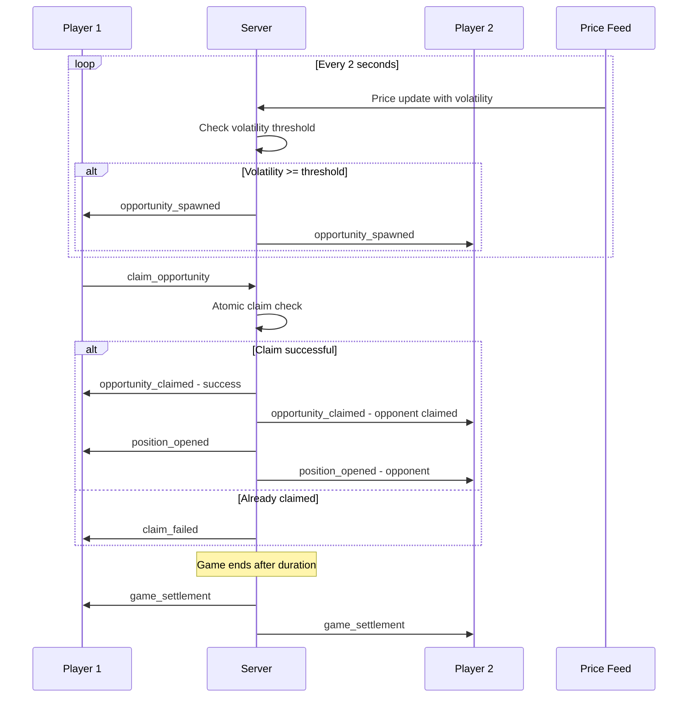

# Order Queue Trading System - Architecture Plan

## Executive Summary

Replace the arcade-style "falling coins" mechanic with a strategic **Order Queue System** that aligns with perpetual DEX trading patterns. Players claim price-driven opportunities from a shared queue, reducing cognitive load while maintaining competitive multiplayer dynamics.

---

## Current State Analysis

### Problems with Falling Coins

| Issue | Impact |
|-------|--------|
| High cognitive load | Players track moving objects instead of price action |
| Arcade mechanic | Swiping feels disconnected from trading |
| Random timing | No connection to market volatility |
| Visual clutter | Distracts from price chart - the core trading signal |
| No strategy | Reactive gameplay, not thoughtful positioning |

### What Works Well (Keep)

- Fixed $1 collateral per position
- 500x leverage (aligned with perp standards)
- Real-time liquidation at 80% health
- Settlement at game end
- Competitive multiplayer format

---

## Proposed Solution: Order Queue System

### Core Concept

```
┌─────────────────────────────────────────────────────────────────┐
│                        GAME SCREEN                              │
├─────────────────────────────────────────────────────────────────┤
│                                                                 │
│  ┌─────────────────────────────────────────────────────────┐   │
│  │              LIVE PRICE CHART (Candlestick)             │   │
│  │         BTC-PERP: $97,234.56  ▲ +0.34%                  │   │
│  └─────────────────────────────────────────────────────────┘   │
│                                                                 │
│  ┌─────────────────────────────────────────────────────────┐   │
│  │              OPPORTUNITY QUEUE                          │   │
│  │  ┌─────────┐ ┌─────────┐ ┌─────────┐ ┌─────────┐       │   │
│  │  │ LONG    │ │ SHORT   │ │ LONG    │ │ SHORT   │       │   │
│  │  │ @97250  │ │ @97300  │ │ @97200  │ │ @97350  │       │   │
│  │  │ 2x pts  │ │ 1.5x    │ │ 3x pts  │ │ 1x pts  │       │   │
│  │  └─────────┘ └─────────┘ └─────────┘ └─────────┘       │   │
│  │       ⬆ Tap to claim - first come first served          │   │
│  └─────────────────────────────────────────────────────────┘   │
│                                                                 │
│  ┌──────────────────────┐  ┌──────────────────────┐            │
│  │    YOUR POSITIONS    │  │   OPPONENT POSITIONS │            │
│  │  LONG @97200 +$2.34  │  │  SHORT @97300 -$1.20 │            │
│  │  SHORT @97350 -$0.80 │  │  LONG @97250 +$1.50  │            │
│  │  ─────────────────── │  │  ─────────────────── │            │
│  │  Total PnL: +$1.54   │  │  Total PnL: +$0.30   │            │
│  └──────────────────────┘  └──────────────────────┘            │
│                                                                 │
│  ┌─────────────────────────────────────────────────────────┐   │
│  │  Balance: $8.46  │  Positions: 2/10  │  Time: 1:24      │   │
│  └─────────────────────────────────────────────────────────┘   │
└─────────────────────────────────────────────────────────────────┘
```

### Key Mechanics

#### 1. Opportunity Generation

Opportunities spawn based on **price volatility**, not random timers:

```typescript
interface TradingOpportunity {
  id: string
  direction: 'long' | 'short'
  entryPrice: number  // Current oracle price
  multiplier: number  // 1x-3x based on volatility
  expiresAt: number   // 5-10 second window to claim
  volatility: 'low' | 'medium' | 'high'
}

// Generation logic
function generateOpportunity(currentPrice: number, volatility: number): Opportunity {
  const direction = volatility > 0 ? 'long' : 'short'
  const multiplier = Math.abs(volatility) > 0.5 ? 3 : Math.abs(volatility) > 0.2 ? 2 : 1
  
  return {
    id: generateId(),
    direction,
    entryPrice: currentPrice,
    multiplier,
    expiresAt: Date.now() + (multiplier * 3000), // Higher multiplier = more time
    volatility: categorizeVolatility(volatility)
  }
}
```

#### 2. Claiming System

- **First-come-first-served**: Both players see the same queue
- **Quick decision**: Tap to claim before opponent
- **Strategic choice**: Higher multipliers = higher risk/reward
- **Limited slots**: Queue shows 4-6 opportunities max

```typescript
// Server-side claiming with race condition handling
function claimOpportunity(playerId: string, opportunityId: string): ClaimResult {
  const opportunity = queue.get(opportunityId)
  
  // Race condition: already claimed
  if (!opportunity || opportunity.claimedBy) {
    return { success: false, reason: 'already_claimed' }
  }
  
  // Atomic claim
  opportunity.claimedBy = playerId
  opportunity.claimedAt = Date.now()
  
  // Create position
  const position = createPosition(playerId, opportunity)
  
  // Notify both players
  io.to(roomId).emit('opportunity_claimed', {
    opportunityId,
    playerId,
    position
  })
  
  return { success: true, position }
}
```

#### 3. Multiplier System

Rewards strategic timing based on market volatility:

| Volatility | Multiplier | Description |
|------------|------------|-------------|
| Low (< 0.2%) | 1x | Standard position |
| Medium (0.2-0.5%) | 2x | Good opportunity |
| High (> 0.5%) | 3x | Rare, high-reward |

Multiplier affects:
- **PnL calculation**: `realizedPnl = collateral * leverage * priceChange * multiplier`
- **Expiration time**: Higher multiplier = more time to decide
- **Visual prominence**: 3x opportunities glow/pulse

---

## Technical Architecture

### Server-Side Changes

#### New Event Types

```typescript
// Server → Client
interface OpportunitySpawnedEvent {
  opportunityId: string
  direction: 'long' | 'short'
  entryPrice: number
  multiplier: number
  expiresAt: number
}

interface OpportunityClaimedEvent {
  opportunityId: string
  playerId: string
  playerName: string
}

interface OpportunityExpiredEvent {
  opportunityId: string
}

// Client → Server
interface ClaimOpportunityPayload {
  opportunityId: string
}
```

#### Game Loop Modifications

```typescript
// Replace coin spawning with opportunity spawning
function startOpportunityLoop(io: Server, room: GameRoom): void {
  const opportunityInterval = setInterval(() => {
    if (room.isShutdown || room.players.size < 2) return
    
    // Get current volatility from price feed
    const volatility = priceFeed.getRecentVolatility() // % change over last 5s
    
    // Only spawn if volatility threshold met
    if (Math.abs(volatility) >= MIN_VOLATILITY_THRESHOLD) {
      const opportunity = generateOpportunity(
        priceFeed.getLatestPrice(),
        volatility
      )
      
      room.addOpportunity(opportunity)
      io.to(room.id).emit('opportunity_spawned', opportunity)
    }
  }, OPPORTUNITY_CHECK_INTERVAL) // Check every 2 seconds
  
  room.trackInterval(opportunityInterval)
}
```

### Client-Side Changes

#### New Components

```
frontend/games/hyper-swiper/components/
├── OpportunityQueue.tsx      # Main queue display
├── OpportunityCard.tsx       # Individual opportunity tile
├── PositionList.tsx          # Open positions display
├── MultiplierBadge.tsx       # 1x/2x/3x indicator
└── ClaimAnimation.tsx        # Feedback on claim
```

#### Store Updates

```typescript
interface TradingState {
  // ... existing state ...
  
  // New opportunity state
  opportunities: Map<string, Opportunity>
  claimInProgress: string | null  // opportunityId being claimed
  
  // Actions
  claimOpportunity: (opportunityId: string) => void
  handleOpportunitySpawned: (event: OpportunitySpawnedEvent) => void
  handleOpportunityClaimed: (event: OpportunityClaimedEvent) => void
  handleOpportunityExpired: (event: OpportunityExpiredEvent) => void
}
```

#### Remove/Deprecate

- `TradingScene.ts` - Remove coin physics, collision detection
- `Token.ts` - No longer needed
- `BladeRenderer.ts` - Swipe mechanic removed
- `SpatialGrid.ts` - No collision detection needed

---

## User Experience Flow

### Game Sequence



### Interaction States

| State | Visual Feedback |
|-------|-----------------|
| Opportunity available | Card visible in queue |
| Hovering | Card highlights, cursor changes |
| Claiming | Spinner/loading state |
| Claimed by you | Green checkmark, moves to positions |
| Claimed by opponent | Red X, card fades out |
| Expired | Card grays out, removes from queue |

---

## Cognitive Load Reduction

### Before vs After

| Aspect | Falling Coins | Order Queue |
|--------|--------------|-------------|
| Visual focus | Split: coins + price | Single: price chart |
| Decision time | Instant reaction | 5-10 seconds |
| Motor skill | Swipe accuracy required | Simple tap |
| Mental model | Arcade game | Trading interface |
| Information density | High (moving objects) | Low (static cards) |

### Design Principles Applied

1. **Recognition over recall**: Opportunities show entry price and multiplier clearly
2. **Consistency**: Same UI patterns as perp DEX (long = green, short = red)
3. **Error prevention**: Can't claim expired or already-claimed opportunities
4. **Help users learn**: Multiplier system teaches volatility = opportunity
5. **Flexible efficiency**: Quick tap for experienced users, clear labels for newcomers

---

## Implementation Phases

### Phase 1: Core Queue System
- [ ] Create `OpportunityQueue` component
- [ ] Implement server-side opportunity generation
- [ ] Add claim/claim-failed socket events
- [ ] Update trading store for opportunities

### Phase 2: Visual Polish
- [ ] Design opportunity cards with multiplier badges
- [ ] Add claim animations and feedback
- [ ] Integrate with existing price chart
- [ ] Mobile-responsive layout

### Phase 3: Game Balance
- [ ] Tune volatility thresholds
- [ ] Adjust multiplier distribution
- [ ] Test claim race conditions
- [ ] Balance opportunity spawn rate

### Phase 4: Cleanup
- [ ] Remove Phaser coin physics code
- [ ] Deprecate unused systems (BladeRenderer, Token, SpatialGrid)
- [ ] Update HowToPlayModal
- [ ] Performance testing

---

## Open Questions

1. **Queue size**: How many opportunities visible at once? (Recommend: 4-6)
2. **Expiration time**: Base time before multiplier bonus? (Recommend: 5 seconds)
3. **Volatility threshold**: Minimum % change to spawn? (Recommend: 0.1%)
4. **Concurrent limits**: Max opportunities per player? (Recommend: 10, same as current)
5. **Tie handling**: What if both players tap simultaneously? (Server-side atomic resolution)

---

## Success Metrics

- **Reduced cognitive load**: Measured by user testing feedback
- **Increased strategic play**: Higher correlation between volatility and claims
- **Maintained engagement**: Similar session lengths to current game
- **Positive reception**: Player feedback on new mechanic
