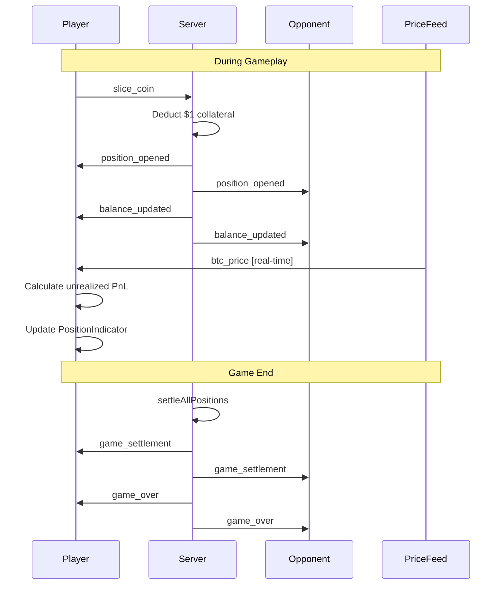

# Perp-Style Positions Architecture Plan

## Overview

Transform the current 5-second binary option mechanic into a perpetual-style position system where:
- Positions stay **open until game end** (no 5-second settlement)
- **Real-time PnL** is displayed using live price feed (percentage only: `+Y.Y%`)
- **No fund transfers** between players during gameplay
- Each position costs **$1 collateral** from player balance
- **Max 10 positions** per player (limited by $10 starting balance)
- Final settlement happens at **game end** only
- **Winner determined by total realized PnL** (not balance)
- **Tug-of-war removed completely**

## Current vs New Architecture

### Current Flow (5-Second Binary Options)
```
Slice Coin → Create Order → 5s Timer → settleOrder() → transferFunds() → Remove Order
                                    ↓
                           Winner gets $ from Loser
```

### New Flow (Perp-Style Positions)
```
Slice Coin → Create Position → Deduct $1 Collateral → Position Stays Open
                                                              ↓
                                              Real-time PnL Display
                                                              ↓
                                         Game End → Settle All Positions
                                                              ↓
                                    Final PnL Calculation (for display only)
```

---

## Detailed Changes

### 1. Server-Side Types (`frontend/app/api/socket/game-events-modules/types.ts`)

**Remove:**
- `settlesAt` field from `PendingOrder`
- 5-second settlement timer concept

**Update `PendingOrder` to `OpenPosition`:**
```typescript
interface OpenPosition {
  id: string
  playerId: string
  playerName: string
  coinType: 'call' | 'put'  // Maps to isLong: call=true, put=false
  priceAtOrder: number      // Entry price (renamed to openPrice)
  leverage: number          // Leverage multiplier
  collateral: number        // Fixed at $1
  openedAt: number          // Timestamp when position opened
  isPlayer1: boolean       // For tug-of-war calculation (kept for compatibility)
}
```

### 2. Server-Side Game Logic (`frontend/app/api/socket/game-events-modules/index.ts`)

#### `handleSlice()` Changes:
- **Remove:** `settlesAt: Date.now() + ORDER_SETTLEMENT_DURATION_MS`
- **Remove:** 5-second `setTimeout` for settlement
- **Add:** Deduct $1 from player balance immediately (collateral)
- **Emit:** `position_opened` event instead of `order_placed`
- **Emit:** `balance_updated` event for collateral deduction

```typescript
// New handleSlice logic
async function handleSlice(io, manager, room, playerId, data): Promise<void> {
  // ... validation ...
  
  const position: OpenPosition = {
    id: `pos-${Date.now()}-${Math.random().toString(36).slice(2, 11)}`,
    playerId,
    playerName: room.players.get(playerId)?.name || 'Unknown',
    coinType: data.coinType,
    priceAtOrder: serverPrice,
    leverage: room.getLeverageForPlayer(playerId),
    collateral: 1, // Fixed $1 per position
    openedAt: Date.now(),
    isPlayer1,
  }

  // Deduct collateral from player balance
  const player = room.players.get(playerId)
  if (player && player.dollars >= 1) {
    player.dollars -= 1
  }
  
  room.addOpenPosition(position)
  
  // Emit events
  io.to(room.id).emit('position_opened', {
    positionId: position.id,
    playerId: position.playerId,
    playerName: position.playerName,
    isLong: position.coinType === 'call',
    leverage: position.leverage,
    collateral: position.collateral,
    openPrice: position.priceAtOrder,
  })
  
  io.to(room.id).emit('balance_updated', {
    playerId,
    newBalance: player.dollars,
    reason: 'position_opened',
    positionId: position.id,
    collateral: 1,
  })
}
```

#### Remove `settleOrder()` Function:
- Delete the entire `settleOrder()` function
- Delete the `transferFunds()` helper (no longer needed during gameplay)

#### Add `settleAllPositions()` for Game End:
```typescript
function settleAllPositions(io: SocketIOServer, room: GameRoom): void {
  const closePrice = priceFeed.getLatestPrice()
  const settlements: PositionSettlementResult[] = []
  
  for (const [positionId, position] of room.openPositions) {
    const priceChange = (closePrice - position.priceAtOrder) / position.priceAtOrder
    const isLong = position.coinType === 'call'
    
    // PnL = collateral * leverage * price_change_percent * direction
    // For LONG: profit when price goes up
    // For SHORT: profit when price goes down
    const directionMultiplier = isLong ? 1 : -1
    const pnl = position.collateral * position.leverage * priceChange * directionMultiplier * 100
    
    settlements.push({
      positionId,
      playerId: position.playerId,
      playerName: position.playerName,
      isLong,
      leverage: position.leverage,
      collateral: position.collateral,
      openPrice: position.priceAtOrder,
      closePrice,
      realizedPnl: pnl,
      isProfitable: pnl > 0,
    })
  }
  
  // Calculate player totals
  const playerResults = calculatePlayerResults(room, settlements)
  
  io.to(room.id).emit('game_settlement', {
    closePrice,
    positions: settlements,
    playerResults,
    winner: determineWinner(playerResults),
  })
}
```

#### Update `endGame()`:
```typescript
function endGame(io, manager, room, reason): void {
  if (room.getIsClosing()) return
  room.setClosing()

  // Settle ALL positions at game end
  settleAllPositions(io, room)

  const winner = room.getWinner()
  io.to(room.id).emit('game_over', {
    winnerId: winner?.id,
    winnerName: winner?.name,
    reason,
  })

  // Cleanup...
}
```

### 3. GameRoom Class Updates (`frontend/app/api/socket/game-events-modules/GameRoom.ts`)

```typescript
export class GameRoom {
  // Rename pendingOrders to openPositions
  readonly openPositions: Map<string, OpenPosition>
  
  // Remove: readonly pendingOrders: Map<string, PendingOrder>
  
  addOpenPosition(position: OpenPosition): void {
    this.openPositions.set(position.id, position)
  }
  
  removeOpenPosition(positionId: string): void {
    this.openPositions.delete(positionId)
  }
}
```

### 4. Client-Side Types (`frontend/game/types/trading.ts`)

The types already have good foundations for perp-style positions. Key types to use:

- `Position` interface (lines 183-206) - already defined
- `PositionOpenedEvent` (lines 212-221)
- `PositionSettlementResult` (lines 226-237)
- `GameSettlementEvent` (lines 254-263)

**Update `OrderPlacedEvent` to `PositionOpenedEvent`:**
```typescript
export interface PositionOpenedEvent {
  positionId: string
  playerId: string
  playerName: string
  pairIndex: number      // 0 = BTC/USD
  isLong: boolean        // true=LONG, false=SHORT
  leverage: number
  collateral: number     // Fixed at $1
  openPrice: number
}
```

### 5. Client-Side Store (`frontend/game/stores/trading-store-modules/index.ts`)

#### State Changes:
```typescript
// Remove:
activeOrders: Map<string, OrderPlacedEvent>
pendingOrders: Map<string, SettlementEvent>
latestSettlement: SettlementEvent | null

// Add:
openPositions: Map<string, Position>
gameSettlement: GameSettlementEvent | null
```

#### Socket Event Handlers:
```typescript
// Remove:
socket.on('order_placed', ...)
socket.on('order_settled', ...)

// Add:
socket.on('position_opened', (position: PositionOpenedEvent) => {
  const { openPositions } = get()
  const newPosition: Position = {
    id: position.positionId,
    playerId: position.playerId,
    playerName: position.playerName,
    pairIndex: position.pairIndex,
    isLong: position.isLong,
    leverage: position.leverage,
    collateral: position.collateral,
    openPrice: position.openPrice,
    closePrice: null,
    realizedPnl: 0,
    openedAt: Date.now(),
    settledAt: null,
    status: 'open',
  }
  const newPositions = new Map(openPositions)
  newPositions.set(position.positionId, newPosition)
  set({ openPositions: newPositions })
})

socket.on('game_settlement', (settlement: GameSettlementEvent) => {
  // Update all positions with settlement data
  // Store final results for GameOverModal
  set({ gameSettlement: settlement })
})
```

#### Remove Functions:
- `handleOrderPlaced()`
- `handleSettlement()`
- `cleanupOrphanedOrders()` (no longer needed - no 5-sec timeouts)

#### Add Functions:
- `handlePositionOpened()`
- `handleGameSettlement()`

### 6. PositionIndicator Component (`frontend/components/PositionIndicator.tsx`)

**Complete Redesign for Always-Visible Real-Time PnL:**

```typescript
export function PositionIndicator() {
  const { openPositions, localPlayerId, priceData, leverage } = useTradingStore()
  
  // Get local player's open positions
  const localPositions = Array.from(openPositions.values())
    .filter((pos) => pos.playerId === localPlayerId)
    .sort((a, b) => b.openedAt - a.openedAt)
  
  return (
    <div className="fixed left-0 right-0 z-20 px-3 pb-2 bottom-56 pointer-events-none">
      <div className="max-w-2xl mx-auto">
        {localPositions.map((position) => {
          // Real-time PnL calculation
          const currentPrice = priceData?.price ?? position.openPrice
          const priceChangePercent = (currentPrice - position.openPrice) / position.openPrice
          const directionMultiplier = position.isLong ? 1 : -1
          const unrealizedPnl = position.collateral * position.leverage * priceChangePercent * directionMultiplier * 100
          const pnlPercent = priceChangePercent * directionMultiplier * position.leverage * 100
          
          return (
            <PositionCard
              key={position.id}
              position={position}
              currentPrice={currentPrice}
              unrealizedPnl={unrealizedPnl}
              pnlPercent={pnlPercent}
            />
          )
        })}
        
        {/* Show placeholder if no positions */}
        {localPositions.length === 0 && (
          <EmptyPositionsPlaceholder />
        )}
      </div>
    </div>
  )
}
```

**Key UI Changes:**
- Remove countdown timer
- Remove "settled" state display
- Show real-time PnL (green for profit, red for loss)
- Always visible (even when empty - show placeholder)
- Display: Entry Price | Current Price | Unrealized PnL | Leverage

### 7. GameOverModal Updates (`frontend/components/GameOverModal.tsx`)

Show final settlement results from `gameSettlement`:

```typescript
export function GameOverModal() {
  const { gameSettlement, isGameOver } = useTradingStore()
  
  if (!isGameOver || !gameSettlement) return null
  
  return (
    <Modal>
      <h2>Game Over</h2>
      <p>Winner: {gameSettlement.winner.playerName}</p>
      <p>Final Price: ${gameSettlement.closePrice}</p>
      
      <h3>Your Positions</h3>
      {gameSettlement.positions.map((pos) => (
        <PositionResult key={pos.positionId} position={pos} />
      ))}
      
      <h3>Final Results</h3>
      {gameSettlement.playerResults.map((result) => (
        <PlayerResult key={result.playerId} result={result} />
      ))}
    </Modal>
  )
}
```

---

## Constants Update (`frontend/game/constants.ts`)

```typescript
export const GAME_CONFIG = {
  STARTING_CASH: 10,        // Keep - $10 starting balance
  GAME_DURATION_MS: 150000, // Keep - 2.5 minutes
  POSITION_COLLATERAL: 1,   // NEW - $1 per position
  MAX_POSITIONS: 10,        // NEW - Max positions per player
  // REMOVE: ORDER_SETTLEMENT_DURATION_MS: 5000
} as const
```

---

## Confirmed Design Decisions

| Decision | Choice |
|----------|--------|
| PnL Display Format | **Percentage only** (`+Y.Y%` or `-Y.Y%`) |
| Position Limit | **Max 10 positions** (limited by $10 balance) |
| Winner Determination | **Total realized PnL** at game end |
| Tug-of-War | **Removed completely** |

---

## Event Flow Diagram



---

## Migration Checklist

### Server-Side Files:
- [ ] `frontend/app/api/socket/game-events-modules/types.ts` - Update types
- [ ] `frontend/app/api/socket/game-events-modules/index.ts` - Major refactor
- [ ] `frontend/app/api/socket/game-events-modules/GameRoom.ts` - Rename pendingOrders
- [ ] `frontend/game/constants.ts` - Remove ORDER_SETTLEMENT_DURATION_MS

### Client-Side Files:
- [ ] `frontend/game/types/trading.ts` - Update/verify types
- [ ] `frontend/game/stores/trading-store-modules/index.ts` - Major refactor
- [ ] `frontend/game/stores/trading-store-modules/types.ts` - Update state types
- [ ] `frontend/components/PositionIndicator.tsx` - Complete redesign
- [ ] `frontend/components/GameOverModal.tsx` - Add settlement display

### Testing:
- [ ] Verify position opening deducts $1
- [ ] Verify real-time PnL calculation
- [ ] Verify game-end settlement
- [ ] Verify PositionIndicator always visible
- [ ] Test with multiple positions
- [ ] Test game over flow

---

## Additional Implementation Notes

### Zero Balance Handling
When a player tries to open a position with $0 balance:
- **Client-side**: Disable coin slicing or show error toast
- **Server-side**: Reject the slice request with error message

### PnL Calculation Formula
```
unrealizedPnlPercent = (currentPrice - openPrice) / openPrice * 100 * leverage * direction

Where:
- direction = 1 for LONG (call)
- direction = -1 for SHORT (put)
```

### Winner Determination at Game End
```typescript
function determineWinner(playerResults: PlayerSettlementResult[]): { playerId: string; playerName: string; winningBalance: number } {
  const sorted = playerResults.sort((a, b) => b.totalPnl - a.totalPnl)
  const winner = sorted[0]
  return {
    playerId: winner.playerId,
    playerName: winner.playerName,
    winningBalance: winner.finalBalance,
  }
}
```

### Components to Remove/Update
- **Remove**: TugOfWarBar component (if exists)
- **Remove**: Any countdown timers in UI
- **Update**: Balance display to show remaining collateral ($10 - positions opened)
