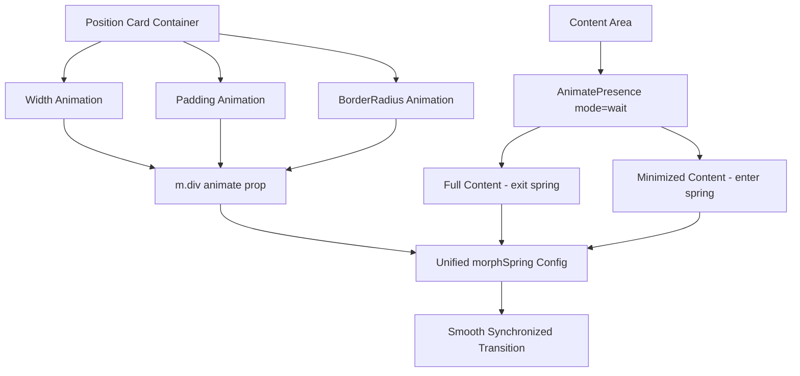

# Position Indicator Animation Fix Plan

## Problem Summary

The [`PositionIndicator.tsx`](frontend/games/hyper-swiper/components/PositionIndicator.tsx) component has a jumpy/uneven animation when transitioning from the large pill (expanded state) to the small pill (minimized state). The entrance animation is smooth, but the size transformation is not.

## Root Cause Analysis

### 1. CSS Width Toggle Without Animation (Primary Issue)

**Location:** [`PositionIndicator.tsx:84`](frontend/games/hyper-swiper/components/PositionIndicator.tsx:84)

```tsx
isMinimized ? 'w-[120px] h-[56px] p-0 ml-auto' : 'w-max max-w-full h-[56px] px-2 md:px-3 ml-auto'
```

The width changes via CSS class toggle from `w-max` (auto-sized) to a fixed `w-[120px]`. This is an **instant class swap**, not a Framer Motion animation. The `transition-shadow` class only animates shadows, not width.

### 2. Content Swap Timing Mismatch

**Full content exit:** [`PositionIndicator.tsx:113`](frontend/games/hyper-swiper/components/PositionIndicator.tsx:113)
```tsx
exit={{ opacity: 0, scale: 0.9, filter: 'blur(4px)' }}
transition={{ duration: 0.25 }}
```

**Minimized content entry:** [`PositionIndicator.tsx:172-179`](frontend/games/hyper-swiper/components/PositionIndicator.tsx:172)
```tsx
initial={{ opacity: 0, scale: 0.6 }}
transition={{ type: 'spring', stiffness: 100, damping: 15, delay: 0.1 }}
```

The exit uses a 250ms duration-based transition while entry uses a spring with 100ms delay. This creates a visual gap where the container snaps before content is ready.

### 3. Inconsistent Spring Configurations

- **Container morph:** `morphSpring` = `{ stiffness: 150, damping: 22 }`
- **Minimized entry:** `{ stiffness: 100, damping: 15 }`

Different spring configs cause timing desynchronization between container size change and content appearance.

### 4. Layout Animation Limitation

The `layout` prop on line 57 handles position changes well, but CSS class-based width changes don't trigger smooth layout animations in Framer Motion.

---

## Solution Architecture

### Strategy: Unified Spring-Driven Animation

Replace CSS class toggles with Framer Motion animated values for ALL properties that change during the transition.



---

## Implementation Plan

### Step 1: Create Unified Animation Configuration

Define a single spring configuration used across all animated properties:

```tsx
const transitionConfig = {
  type: 'spring' as const,
  stiffness: 200,
  damping: 25,
  mass: 0.8,
}
```

### Step 2: Animate Width via Framer Motion

Replace CSS width classes with animated inline styles:

```tsx
// Before (CSS class toggle - instant)
className={cn(
  isMinimized ? 'w-[120px] ...' : 'w-max ...'
)}

// After (Framer Motion animated)
<m.div
  layout
  animate={{
    width: isMinimized ? 120 : 'auto',
  }}
  transition={transitionConfig}
>
```

### Step 3: Animate Padding via Framer Motion

```tsx
// Before (CSS class toggle)
className={cn(
  isMinimized ? 'p-0' : 'px-2 md:px-3'
)}

// After (Framer Motion animated)
animate={{
  paddingLeft: isMinimized ? 0 : 8,
  paddingRight: isMinimized ? 0 : 12,
}}
```

### Step 4: Synchronize Content Transitions

Use `mode="wait"` in AnimatePresence and match timing:

```tsx
<AnimatePresence mode="wait">
  {!isMinimized ? (
    <m.div
      key="full"
      initial={{ opacity: 0 }}
      animate={{ opacity: 1 }}
      exit={{ opacity: 0, scale: 0.95 }}
      transition={{ duration: 0.2 }}
    >
      {/* Full content */}
    </m.div>
  ) : (
    <m.div
      key="minimized"
      initial={{ opacity: 0, scale: 0.95 }}
      animate={{ opacity: 1, scale: 1 }}
      transition={transitionConfig}
    >
      {/* Minimized content */}
    </m.div>
  )}
</AnimatePresence>
```

### Step 5: Remove Delay from Minimized Entry

The `delay: 0.1` causes the content to appear after the container has already started shrinking:

```tsx
// Before
transition={{ type: 'spring', stiffness: 100, damping: 15, delay: 0.1 }}

// After - no delay, same spring as container
transition={transitionConfig}
```

### Step 6: Add Width Constraint for Smooth Auto-to-Fixed Transition

Framer Motion handles `width: 'auto'` → `width: 120` poorly. Use a measured approach:

```tsx
// Option A: Use max-width constraint
animate={{
  width: isMinimized ? 120 : undefined,
  maxWidth: isMinimized ? 120 : 400,
}}

// Option B: Pre-calculate width and animate between fixed values
const [fullWidth, setFullWidth] = useState(0)
// Measure on mount, then animate from fullWidth to 120
```

---

## Detailed Code Changes

### File: [`PositionIndicator.tsx`](frontend/games/hyper-swiper/components/PositionIndicator.tsx)

#### Change 1: Update Container Animation (Lines 56-86)

```tsx
<m.div
  layout
  key={position.id}
  initial={{ y: 80, opacity: 0 }}
  animate={{
    y: 0,
    opacity: 1,
    width: isMinimized ? 120 : 'auto',
    paddingLeft: isMinimized ? 0 : 8,
    paddingRight: isMinimized ? 0 : 12,
  }}
  exit={{ y: 40, opacity: 0, scale: 0.9 }}
  transition={{
    y: { type: 'spring', damping: 20, stiffness: 200 },
    opacity: { duration: 0.3 },
    width: morphSpring,
    paddingLeft: morphSpring,
    paddingRight: morphSpring,
    layout: morphSpring,
  }}
  className={cn(
    'glass-panel-vibrant mb-2 relative overflow-hidden flex-shrink-0',
    'pointer-events-auto cursor-pointer flex items-center h-[56px] ml-auto',
    borderStyle,
  )}
  onClick={() => onClose(position.id)}
>
```

#### Change 2: Update morphSpring Configuration (Lines 46-53)

```tsx
const morphSpring = {
  type: 'spring' as const,
  stiffness: 200,  // Increased from 150 for snappier feel
  damping: 25,     // Increased from 22 for less oscillation
  mass: 0.8,       // Added for smoother deceleration
}
```

#### Change 3: Update AnimatePresence Mode (Line 107)

```tsx
<AnimatePresence mode="wait">
```

#### Change 4: Update Full Content Exit (Lines 109-114)

```tsx
<m.div
  key="full"
  initial={{ opacity: 0 }}
  animate={{ opacity: 1 }}
  exit={{ opacity: 0, scale: 0.95 }}
  transition={{ 
    opacity: { duration: 0.15 },
    scale: { duration: 0.15 },
  }}
  className="relative flex items-center justify-between gap-3 w-full h-full"
>
```

#### Change 5: Update Minimized Content Entry (Lines 170-180)

```tsx
<m.div
  key="minimized"
  initial={{ opacity: 0, scale: 0.95 }}
  animate={{ opacity: 1, scale: 1 }}
  exit={{ opacity: 0 }}
  transition={{
    opacity: { duration: 0.15 },
    scale: morphSpring,
  }}
  className="flex items-center justify-center w-full h-full relative z-10 gap-1.5"
>
```

---

## Animation Timing Diagram

```
Timeline: 0ms ────────────────────────────────────────── 400ms

Container Width:
├──────────────────────────────────────────────────────┤
│ ████████████████████████░░░░░░░░░░░░░░░░░░░░░░░░░░░ │ (auto → 120px)
└──────────────────────────────────────────────────────┘

Full Content Exit:
├──────────────────────────────────────────────────────┤
│ ████████████░░░░░░░░░░░░░░░░░░░░░░░░░░░░░░░░░░░░░░░ │ (opacity 1→0)
└──────────────────────────────────────────────────────┘

Minimized Content Enter:
├──────────────────────────────────────────────────────┤
│ ░░░░░░░░░░░░░░░░░░░░░░░░░░░░░░░░░░░░░░░░░████████████│ (opacity 0→1)
└──────────────────────────────────────────────────────┘

Result: Smooth crossfade with synchronized container shrink
```

---

## Testing Checklist

- [ ] Entrance animation remains smooth (y-translation + opacity)
- [ ] Auto-minimize after 3.5s triggers smooth width transition
- [ ] Direction icon morphs smoothly between states (layoutId preserved)
- [ ] No visual gap between content exit and entry
- [ ] PnL percentage appears smoothly in minimized state
- [ ] Border color transitions remain smooth
- [ ] Click to close works during transition
- [ ] Multiple positions animate independently without interference

---

## Alternative Approaches Considered

### Option A: CSS Transitions with transition-all
**Rejected:** CSS transitions on width from auto to fixed don't animate smoothly - they snap.

### Option B: Keyframe Animation
**Rejected:** Less control over spring physics, harder to synchronize with content swap.

### Option C: FLIP Animation Technique
**Rejected:** Framer Motion's `layout` prop already implements FLIP internally. Additional complexity without benefit.

### Selected: Framer Motion Animated Values
**Rationale:** Native Framer Motion animation for all properties ensures consistent timing and spring physics across the entire transition.
