# PositionIndicator Refactoring Plan

## Status: COMPLETED ✅

## Overview

Refactored `frontend/components/PositionIndicator.tsx` to align with the Avantis position-based model by permanently disabling auto-dismissal logic and removing all binary winner/loser prediction dependencies.

## Current State Analysis

### Existing Implementation Issues

The current [`PositionIndicator.tsx`](frontend/components/PositionIndicator.tsx) component uses the **legacy order-based model**:

| Current Approach                      | Issue                                                               |
| ------------------------------------- | ------------------------------------------------------------------- |
| Uses `activeOrders` from legacy store | Should use `openPositions` from Avantis-aligned store               |
| Sorts by `settlesAt` timestamp        | Positions have no settlement deadline - they persist until game end |
| Uses `coinType: 'call' \| 'put'`      | Should use `isLong: boolean` for direction                          |
| Implicit 5-second settlement window   | Positions should remain indefinitely until game settlement          |

### Key Dependencies to Remove

```typescript
// LEGACY - To be removed
activeOrders // Map<string, OrderPlacedEvent>
order.settlesAt // Settlement deadline
order.coinType // 'call' | 'put' binary prediction
```

### New Dependencies to Use

```typescript
// AVANTIS-ALIGNED - To be used
openPositions // Map<string, Position>
position.isLong // boolean direction
position.openPrice // Entry price
position.leverage // Leverage multiplier
position.collateral // Position size ($1 fixed)
position.status // 'open' | 'settled'
```

## Architecture Comparison

```mermaid
flowchart TB
    subgraph Legacy [Legacy Model - REMOVE]
        A1[Player slices coin] --> B1[OrderPlacedEvent]
        B1 --> C1[activeOrders Map]
        C1 --> D1[5-second settlement]
        D1 --> E1[SettlementEvent with winner/loser]
        E1 --> F1[Transfer funds between players]
    end

    subgraph Avantis [Avantis Model - USE]
        A2[Player slices coin] --> B2[PositionOpenedEvent]
        B2 --> C2[openPositions Map]
        C2 --> D2[Position stays OPEN]
        D2 --> E2[Game ends]
        E2 --> F2[GameSettlementEvent]
        F2 --> G2[All positions settled at once]
        G2 --> H2[Realized PnL calculated]
    end
```



## Detailed Changes

### 1. Update Store Dependencies

**Before:**

```typescript
const { activeOrders, localPlayerId, priceData, leverage } = useTradingStore()

const localOrders = Array.from(activeOrders.values())
  .filter((order) => order.playerId === localPlayerId)
  .sort((a, b) => a.settlesAt - b.settlesAt)
  .slice(0, 5)
```

**After:**

```typescript
const { openPositions, localPlayerId, priceData } = useTradingStore()

const localPositions = Array.from(openPositions.values())
  .filter((position) => position.playerId === localPlayerId)
  .filter((position) => position.status === 'open')
  .sort((a, b) => a.openedAt - b.openedAt) // Sort by creation time
  .slice(0, 5)
```

### 2. Update Direction Logic

**Before:**

```typescript
const isCall = order.coinType === 'call'
const isInProfit = pnl !== null && ((isCall && pnl > 0) || (!isCall && pnl < 0))
```

**After:**

```typescript
const isLong = position.isLong
const isInProfit = pnl !== null && ((isLong && pnl > 0) || (!isLong && pnl < 0))
```

### 3. Update PnL Calculation

The PnL calculation should use the position's own leverage:

**Before:**

```typescript
const pnl =
  priceData && order.priceAtOrder
    ? ((priceData.price - order.priceAtOrder) / order.priceAtOrder) * 100 * leverage
    : null
```

**After:**

```typescript
const pnl =
  priceData && position.openPrice
    ? ((priceData.price - position.openPrice) / position.openPrice) * 100 * position.leverage
    : null
```

### 4. Remove Auto-Dismissal Logic

The current component does NOT have explicit auto-dismissal logic, which is correct. However, we must ensure:

- No `setTimeout` for hiding positions
- No `settlementDuration` dependencies
- No outcome-based visibility toggling
- Positions remain visible until game reset or explicit user action

### 5. Update Display Labels

**Before:**

```typescript
{
  order.coinType === 'call' ? 'LONG' : 'SHORT'
}
```

**After:**

```typescript
{
  position.isLong ? 'LONG' : 'SHORT'
}
```

### 6. Update Entry Price Reference

**Before:**

```typescript
<span>${formatPrice(order.priceAtOrder)}</span>
```

**After:**

```typescript
<span>${formatPrice(position.openPrice)}</span>
```

### 7. Update Leverage Display

**Before:**

```typescript
{leverage > 1 && (
  <div>{leverage}X</div>
)}
```

**After:**

```typescript
{position.leverage > 1 && (
  <div>{position.leverage}X</div>
)}
```

## Key Principle: No Inter-Position Payments

The refactored component must NOT trigger or display any payment transfers between positions. In the Avantis model:

- Positions are **independent** - no loser pays winner during the game
- All positions are **settled at game end** via `GameSettlementEvent`
- Unrealized PnL is **displayed live** but **no actual transfers** occur until game end
- The `handleSettlement` function in the store still exists for backward compatibility but should NOT be triggered by the PositionIndicator

## Files to Modify

| File                                                                                                         | Changes                                                 |
| ------------------------------------------------------------------------------------------------------------ | ------------------------------------------------------- |
| [`frontend/components/PositionIndicator.tsx`](frontend/components/PositionIndicator.tsx)                     | Main refactoring target - switch to Avantis model       |
| [`frontend/game/stores/trading-store-modules/index.ts`](frontend/game/stores/trading-store-modules/index.ts) | No changes needed - already has `openPositions` support |

## Testing Checklist

After refactoring, verify:

- [ ] Positions appear immediately when coin is sliced
- [ ] Positions remain visible indefinitely (no auto-dismissal)
- [ ] Unrealized PnL updates in real-time with price changes
- [ ] LONG/SHORT labels display correctly based on `isLong`
- [ ] Leverage displays from position's own leverage value
- [ ] Entry price shows `openPrice` correctly
- [ ] No console errors related to undefined properties
- [ ] Multiple positions stack correctly
- [ ] Positions clear only on game reset or explicit action

## Implementation Notes

1. **No local state for timeouts**: The component should NOT implement any `setTimeout` or cleanup routines for hiding positions
2. **Single source of truth**: All state comes from `useTradingStore` - no local derived state
3. **Persistent visibility**: The `AnimatePresence` handles enter/exit animations, but positions only exit when removed from `openPositions` by game reset

## Summary

This refactoring removes the legacy binary prediction model and aligns PositionIndicator with the Avantis position-based approach where:

- Positions persist until game end (not 5 seconds)
- No winner/loser payment transfers during gameplay
- All positions settle simultaneously at game end
- Live unrealized PnL is displayed without triggering actual transfers
