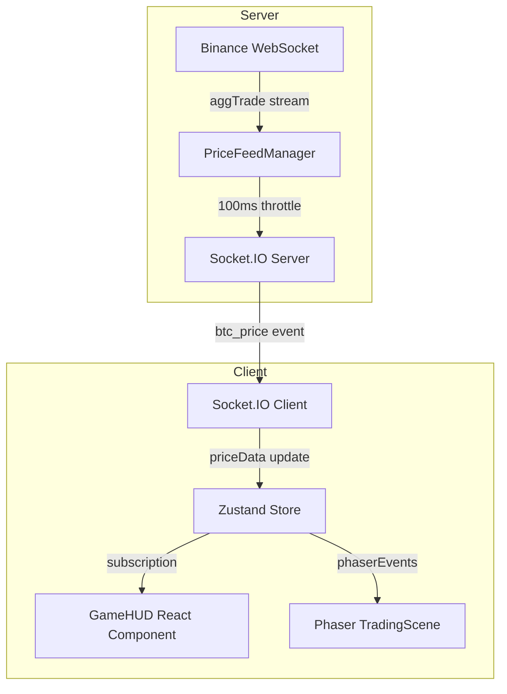
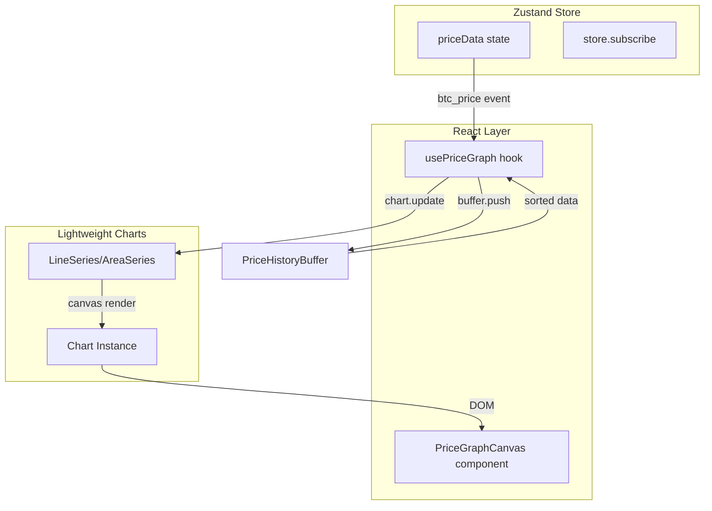

# Real-Time Price Graph Implementation Plan

## Executive Summary

This document outlines the implementation plan for a high-performance real-time line graph to visualize BTC price data on the Hyper Swiper game screen. The system must handle price updates streaming from the server every 100ms and render a continuously progressing visualization without causing UI lag.

---

## 1. Architecture Analysis

### Current System Overview



### Key Files

| File | Purpose |
|------|---------|
| [`PriceFeedManager.ts`](frontend/app/api/socket/game-events-modules/PriceFeedManager.ts) | Server-side Binance WebSocket,100ms broadcast throttle |
| [`trading-store-modules/index.ts`](frontend/games/hyper-swiper/game/stores/trading-store-modules/index.ts) | Zustand store receiving `btc_price` events |
| [`GameHUD.tsx`](frontend/games/hyper-swiper/components/GameHUD.tsx) | React HUD overlay with price display |
| [`CompactPriceRow.tsx`](frontend/games/hyper-swiper/components/GameHUD-modules/CompactPriceRow.tsx) | Current price display component |
| [`TradingScene.ts`](frontend/games/hyper-swiper/game/scenes/TradingScene.ts) | Phaser game scene with grid background |
| [`HyperSwiperClient.tsx`](frontend/app/hyper-swiper/HyperSwiperClient.tsx) | Main game component orchestrator |

---

## 2. Technology Selection

### Recommended: TradingView Lightweight Charts

After consulting Context7 documentation, **TradingView Lightweight Charts** is the optimal choice:

**Advantages:**
- Canvas-based rendering (no DOM manipulation per frame)
- Built-in `update()` method optimized for real-time streaming
- 691 code snippets with High reputation source
- Designed specifically for financial data visualization
- Responsive container resizing support
- Gradient fill support for area series

**Why not alternatives:**
- **D3.js**: Too heavy, requires manual canvas management
- **Recharts**: React-based, would cause re-renders on every update
- **Custom Canvas**: Would require significant development time

### Installation

```bash
cd frontend && bun add lightweight-charts
```

---

## 3. Data Buffering Strategy

### Ring Buffer Architecture

For 100ms updates over a 2.5-minute game (150 seconds):

```
Maximum data points = 150s / 0.1s = 1500 points
Recommended buffer size = 2000 points (with safety margin)
```

### Buffer Implementation

```typescript
interface PriceDataPoint {
  time: number  // Unix timestamp in seconds
  value: number // BTC price
}

class PriceHistoryBuffer {
  private buffer: PriceDataPoint[]
  private maxSize: number
  private writeIndex: number = 0
  
  constructor(maxSize: number = 2000) {
    this.maxSize = maxSize
    this.buffer = []
  }
  
  push(price: number, timestamp: number): void {
    const dataPoint: PriceDataPoint = {
      time: Math.floor(timestamp / 1000), // Convert to seconds for Lightweight Charts
      value: price
    }
    
    if (this.buffer.length < this.maxSize) {
      this.buffer.push(dataPoint)
    } else {
      this.buffer[this.writeIndex] = dataPoint
      this.writeIndex = (this.writeIndex + 1) % this.maxSize
    }
  }
  
  getSorted(): PriceDataPoint[] {
    if (this.buffer.length < this.maxSize) {
      return [...this.buffer].sort((a, b) => a.time - b.time)
    }
    // Ring buffer - rotate to maintain time order
    return [
      ...this.buffer.slice(this.writeIndex),
      ...this.buffer.slice(0, this.writeIndex)
    ]
  }
  
  getLatest(): PriceDataPoint | null {
    if (this.buffer.length === 0) return null
    const lastIndex = (this.writeIndex - 1 + this.maxSize) % this.maxSize
    return this.buffer[lastIndex]
  }
}
```

### Update Strategy

Following Lightweight Charts best practices:

1. **Initial Load**: Use `setData()` with buffered history
2. **Real-time Updates**: Use `update()` for each new price point
3. **Never call `setData()` during streaming** - it replaces all data and causes performance issues

```typescript
// CORRECT: Efficient real-time update
series.update({ time: timestamp, value: price })

// WRONG: Causes re-render of all data
series.setData(allDataPoints)
```

---

## 4. Coordinate Mapping & Grid Integration

### Current Grid Configuration

From [`TradingScene.ts`](frontend/games/hyper-swiper/game/scenes/TradingScene.ts:19-31):

```typescript
const GRID_CONFIG = {
  color: 0x00f3ff,
  minCellWidth: 42,
  maxCellWidth: 72,
  minCellHeight: 30,
  maxCellHeight: 56,
  majorXEvery: 3,
  majorYEvery: 3,
}
```

### Proposed Layout Integration

The graph should be positioned within the existing grid layout. Two options:

#### Option A: Top Section Graph (Recommended)

```
┌─────────────────────────────────────┐
│          PRICE GRAPH                │  Height: ~15% of viewport
│     [Lightweight Charts Canvas]     │
├─────────────────────────────────────┤
│                                     │
│          PHASER GAME                │  Height: ~70% of viewport
│       [TradingScene Canvas]         │
│                                     │
├─────────────────────────────────────┤
│          GAME HUD                   │  Height: ~15% of viewport
│    [Price, Timer, Health, etc.]     │
└─────────────────────────────────────┘
```

#### Option B: Overlay Graph

Position the graph as a semi-transparent overlay within the Phaser canvas area, maintaining full game height.

### Grid Dimension Adjustments

To accommodate the graph in Option A:

```typescript
// In TradingScene.ts - adjust grid calculation
private getGridCellSize() {
  const width = this.cameras.main.width
  const height = this.cameras.main.height * 0.70 // Reduce to 70% for graph space
  
  return {
    cellWidth: Math.round(
      Math.max(GRID_CONFIG.minCellWidth, Math.min(GRID_CONFIG.maxCellWidth, width / 9))
    ),
    cellHeight: Math.round(
      Math.max(GRID_CONFIG.minCellHeight, Math.min(GRID_CONFIG.maxCellHeight, height / 14))
    ),
  }
}
```

### Viewport Coordinate System

```typescript
interface ViewportLayout {
  graph: {
    top: 0
    height: viewportHeight * 0.15
  }
  game: {
    top: viewportHeight * 0.15
    height: viewportHeight * 0.70
  }
  hud: {
    top: viewportHeight * 0.85
    height: viewportHeight * 0.15
  }
}
```

---

## 5. Rendering Loop Architecture

### Component Architecture



### Render Loop Strategy

**Key Principle: Decouple data arrival from rendering**

1. **Data Layer**:100ms updates from Socket.IO → Ring Buffer
2. **Render Layer**: RequestAnimationFrame-driven chart updates
3. **Sync Point**: Chart reads from buffer, not directly from socket

```typescript
// usePriceGraph.ts
export function usePriceGraph(
  containerRef: RefObject<HTMLDivElement>,
  maxDataPoints: number = 500 // Show last 50 seconds at 100ms intervals
) {
  const chartRef = useRef<IChartApi | null>(null)
  const seriesRef = useRef<ISeriesApi<LineSeries> | null>(null)
  const bufferRef = useRef<PriceHistoryBuffer>(new PriceHistoryBuffer(2000))
  const rafRef = useRef<number>(0)
  
  // Initialize chart once
  useEffect(() => {
    if (!containerRef.current) return
    
    const chart = createChart(containerRef.current, {
      layout: {
        background: { type: 'solid', color: 'transparent' },
        textColor: 'rgba(0, 243, 255, 0.7)',
      },
      grid: {
        vertLines: { color: 'rgba(0, 243, 255, 0.1)' },
        horzLines: { color: 'rgba(0, 243, 255, 0.1)' },
      },
      rightPriceScale: {
        borderColor: 'rgba(0, 243, 255, 0.3)',
        scaleMargins: { top: 0.1, bottom: 0.1 },
      },
      timeScale: {
        borderColor: 'rgba(0, 243, 255, 0.3)',
        timeVisible: true,
      },
      crosshair: {
        mode: CrosshairMode.Hidden,
      },
      handleScale: false,
      handleScroll: false,
    })
    
    const series = chart.addSeries(LineSeries, {
      color: '#00f3ff',
      lineWidth: 2,
      lastValueVisible: false,
      crosshairMarkerVisible: false,
    })
    
    chartRef.current = chart
    seriesRef.current = series
    
    return () => {
      cancelAnimationFrame(rafRef.current)
      chart.remove()
    }
  }, [])
  
  // Subscribe to price updates
  useEffect(() => {
    const unsubscribe = useTradingStore.subscribe(
      (state) => state.priceData,
      (priceData) => {
        if (!priceData) return
        
        // Add to buffer
        bufferRef.current.push(priceData.price, priceData.tradeTime)
      }
    )
    
    return unsubscribe
  }, [])
  
  // Render loop - runs at display refresh rate (60fps typically)
  useEffect(() => {
    let lastUpdateTime = 0
    const UPDATE_THROTTLE_MS = 100 // Match server update rate
    
    function renderLoop() {
      const now = performance.now()
      
      if (now - lastUpdateTime >= UPDATE_THROTTLE_MS) {
        const latest = bufferRef.current.getLatest()
        if (latest && seriesRef.current) {
          seriesRef.current.update(latest)
        }
        lastUpdateTime = now
      }
      
      rafRef.current = requestAnimationFrame(renderLoop)
    }
    
    rafRef.current = requestAnimationFrame(renderLoop)
    
    return () => cancelAnimationFrame(rafRef.current)
  }, [])
  
  return {
    fitContent: () => chartRef.current?.timeScale().fitContent(),
  }
}
```

### Performance Optimizations

1. **Batch Updates**: Buffer incoming prices, render at most once per 100ms
2. **Avoid Re-renders**: Chart component uses `React.memo` with custom comparison
3. **Canvas Recycling**: Lightweight Charts reuses canvas, no DOM creation per frame
4. **Memory Management**: Ring buffer prevents unbounded memory growth
5. **Cleanup on Unmount**: Proper RAF cancellation and chart disposal

---

## 6. Component File Structure

```
frontend/games/hyper-swiper/components/
├── PriceGraph/
│   ├── index.ts                    # Barrel export
│   ├── PriceGraphCanvas.tsx        # Main chart component
│   ├── usePriceGraph.ts            # Chart initialization & update hook
│   ├── usePriceHistoryBuffer.ts    # Ring buffer hook
│   ├── types.ts                    # TypeScript interfaces
│   └── constants.ts                # Chart styling constants
├── GameHUD.tsx                     # Modified to include graph
└── GameHUD-modules/
    └── ...existing modules...
```

### File Responsibilities

| File | Responsibility |
|------|----------------|
| `PriceGraphCanvas.tsx` | Container div, responsive sizing, memoized component |
| `usePriceGraph.ts` | Chart lifecycle, series management, update loop |
| `usePriceHistoryBuffer.ts` | Ring buffer implementation, data point management |
| `types.ts` | `PriceDataPoint`, `GraphConfig`, `ViewportLayout` interfaces |
| `constants.ts` | Colors, dimensions, throttle timings |

---

## 7. Integration Steps

### Step 1: Install Dependency

```bash
cd frontend && bun add lightweight-charts
```

### Step 2: Create Buffer Hook

Create [`usePriceHistoryBuffer.ts`](frontend/games/hyper-swiper/components/PriceGraph/usePriceHistoryBuffer.ts) with ring buffer implementation.

### Step 3: Create Chart Hook

Create [`usePriceGraph.ts`](frontend/games/hyper-swiper/components/PriceGraph/usePriceGraph.ts) with Lightweight Charts initialization and update logic.

### Step 4: Create Canvas Component

Create [`PriceGraphCanvas.tsx`](frontend/games/hyper-swiper/components/PriceGraph/PriceGraphCanvas.tsx) as the memoized React component.

### Step 5: Modify GameHUD

Update [`GameHUD.tsx`](frontend/games/hyper-swiper/components/GameHUD.tsx) to include the graph above the price row.

### Step 6: Adjust Grid Layout (Optional)

If using Option A layout, modify [`TradingScene.ts`](frontend/games/hyper-swiper/game/scenes/TradingScene.ts) to account for graph space.

### Step 7: Test Performance

Monitor frame rates and memory usage during gameplay.

---

## 8. Styling Guidelines

### Color Palette (Matching Existing Theme)

```typescript
export const GRAPH_COLORS = {
  // Line
  lineColor: '#00f3ff',
  lineWidth: 2,
  
  // Area gradient (optional)
  areaTopColor: 'rgba(0, 243, 255, 0.3)',
  areaBottomColor: 'rgba(0, 243, 255, 0.02)',
  
  // Grid
  gridLineColor: 'rgba(0, 243, 255, 0.1)',
  
  // Axis
  axisColor: 'rgba(0, 243, 255, 0.3)',
  textColor: 'rgba(0, 243, 255, 0.7)',
  
  // Background
  background: 'transparent',
} as const
```

### Responsive Dimensions

```typescript
export const getGraphDimensions = (viewportWidth: number, viewportHeight: number) => ({
  height: Math.max(80, viewportHeight * 0.12), // Min 80px, ~12% of viewport
  marginBottom: 8,
})
```

---

## 9. Error Handling & Edge Cases

### Handling Missing Data

```typescript
// If price feed disconnects, show loading state
if (!isPriceConnected || priceData === null) {
  return <PriceLoadingState />
}
```

### Handling Rapid Reconnects

```typescript
// Reset buffer on game reset
useEffect(() => {
  if (!isPlaying) {
    bufferRef.current.clear()
  }
}, [isPlaying])
```

### Memory Leak Prevention

```typescript
// Comprehensive cleanup
useEffect(() => {
  return () => {
    cancelAnimationFrame(rafRef.current)
    chartRef.current?.remove()
    bufferRef.current.clear()
  }
}, [])
```

---

## 10. Testing Strategy

### Performance Metrics

| Metric | Target | Measurement Method |
|--------|--------|-------------------|
| Frame Rate | ≥ 55 fps during gameplay | Chrome DevTools Performance |
| Memory Growth | < 1MB per minute | Chrome DevTools Memory |
| Update Latency | < 50ms from socket to screen | Custom timing logs |
| CPU Usage | < 5% additional | Chrome Task Manager |

### Test Scenarios

1. **Normal Operation**: 2.5-minute game with continuous100ms updates
2. **Rapid Price Changes**: Simulate high volatility
3. **Connection Drop**: Verify graceful degradation
4. **Mobile Performance**: Test on low-end devices
5. **Resize Handling**: Test viewport changes during gameplay

---

## 11. Summary

This implementation plan provides a comprehensive strategy for integrating a high-performance real-time price graph into the Hyper Swiper game. The key decisions are:

1. **Technology**: TradingView Lightweight Charts for canvas-based rendering
2. **Data Strategy**: Ring buffer with 2000-point capacity
3. **Update Strategy**: `update()` method, never `setData()` during streaming
4. **Layout**: Top-section graph with adjusted grid dimensions
5. **Performance**: RAF-driven render loop decoupled from socket updates

The architecture ensures smooth 60fps gameplay while displaying real-time price data without UI lag.
