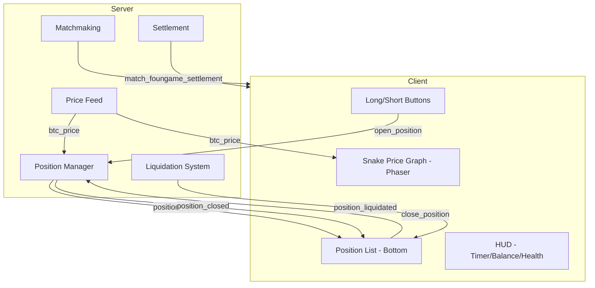

# TapDancer - Simplified Trading Game

## Overview

**TapDancer** is a streamlined trading game derived from HyperSwiper, removing the coin-swiping mechanic while keeping the beautiful snake price graph visualization.

### Core Mechanics
- **Two buttons**: LONG and SHORT - tap to open positions
- **Snake price graph**: Tron-style price visualization with trailing ribbon
- **Positions display**: Open positions appear at the bottom of screen
- **Tap to close**: Tap any position card to close it

### Key Decisions
| Aspect | Decision |
|--------|----------|
| Game Name | TapDancer |
| URL | `/tap-dancer` |
| Remove | Coins, swiping, coin spawning, blade renderer |
| Keep | Phaser (snake graph), matchmaking, positions, liquidation, settlement, price feed |
| New | Direct `open_position` event (no coin trigger) |

---

## Architecture

### Visual Layout

```
┌─────────────────────────────────────┐
│           GAME HUD                  │
│  Timer | Player Health | BTC Price  │
├─────────────────────────────────────┤
│                                     │
│                                     │
│        SNAKE PRICE GRAPH            │
│      (Phaser Canvas)                │
│     ~~~~~~~~~~~~~~~~~~~~~~          │
│                                     │
│                                     │
├─────────────────────────────────────┤
│         POSITION LIST               │
│   [LONG +$2.50] [SHORT -$1.20]      │
│        (tap to close)               │
├─────────────────────────────────────┤
│    [LONG]        [SHORT]            │
│      ↑              ↑               │
│   Open Long     Open Short          │
└─────────────────────────────────────┘
```

### Data Flow



### Directory Structure

```
frontend/
├── domains/
│   ├── index.ts                    # Add tapDancerConfig
│   └── tap-dancer/                 # NEW GAME
│       ├── index.ts                # Public exports
│       ├── meta.config.ts          # Game metadata
│       ├── shared/
│       │   └── trading.types.ts    # Position types (no coins)
│       └── client/
│           ├── game.config.ts      # Client constants
│           ├── state/
│           │   ├── trading.store.ts
│           │   ├── trading.types.ts
│           │   └── slices/index.ts # Zustand store
│           ├── phaser/
│           │   ├── config.ts       # Phaser game config
│           │   └── scenes/
│           │       └── TradingScene.ts  # Scene with snake graph
│           │   └── systems/
│           │       ├── GridBackgroundSystem.ts  # Reuse
│           │       └── SnakePriceGraph.ts       # Reuse (key visual!)
│           └── components/
│               ├── TapDancerClient.tsx
│               ├── GameCanvas.tsx         # Phaser wrapper
│               ├── screens/
│               │   ├── MatchmakingScreen.tsx
│               │   └── GameOverModal.tsx
│               ├── hud/
│               │   └── GameHUD.tsx
│               └── trading/
│                   ├── PositionButtons.tsx    # Long/Short buttons
│                   └── PositionList.tsx       # Bottom position list
│
├── app/
│   └── tap-dancer/
│       └── page.tsx                # Next.js route
│
└── app/api/socket/multiplayer/
    └── index.ts                    # Add open_position handler
```

---

## Implementation Plan

### Phase 1: Foundation

#### 1.1 Create Domain Structure
- [ ] `domains/tap-dancer/index.ts` - exports
- [ ] `domains/tap-dancer/meta.config.ts` - game config
- [ ] `domains/tap-dancer/shared/trading.types.ts` - types without coins
- [ ] Update `domains/index.ts` - add tapDancerConfig

#### 1.2 Create App Route
- [ ] `app/tap-dancer/page.tsx` - Next.js page

### Phase 2: Client State

#### 2.1 Create Zustand Store
- [ ] `domains/tap-dancer/client/state/trading.types.ts`
- [ ] `domains/tap-dancer/client/state/trading.store.ts`
- [ ] `domains/tap-dancer/client/state/slices/index.ts`

**Key differences from HyperSwiper:**
- Remove: `spawnCoin`, `sliceCoin`, `expireCoin`, coin-related state
- Add: `openPosition(direction: 'long' | 'short')` action
- Keep: Connection, matchmaking, positions, price feed, game lifecycle

### Phase 3: Phaser Scene (Simplified)

#### 3.1 Copy & Simplify Phaser Systems
- [ ] `domains/tap-dancer/client/phaser/config.ts`
- [ ] `domains/tap-dancer/client/phaser/scenes/TradingScene.ts`
- [ ] `domains/tap-dancer/client/phaser/systems/GridBackgroundSystem.ts` - Direct copy
- [ ] `domains/tap-dancer/client/phaser/systems/SnakePriceGraph.ts` - Direct copy (KEY VISUAL)

**What to remove from HyperSwiper Phaser:**
- `CoinLifecycleSystem.ts` - No coins
- `CoinRenderer.ts` - No coins
- `BladeRenderer.ts` - No swiping
- `CollisionSystem.ts` - No coins
- `ParticleSystem.ts` - Coin particles
- `Token.ts` - Coin objects

**What to keep:**
- `GridBackgroundSystem.ts` - Animated grid background
- `SnakePriceGraph.ts` - Tron-style price ribbon (100% reuse)

### Phase 4: UI Components

#### 4.1 Main Client Component
- [ ] `domains/tap-dancer/client/components/TapDancerClient.tsx`
- [ ] `domains/tap-dancer/client/components/GameCanvas.tsx` - Phaser wrapper

```tsx
// Pseudocode structure
function TapDancerClient() {
  const { isPlaying, connect, disconnect } = useTradingStore()
  
  useEffect(() => {
    connect()
    return () => disconnect()
  }, [])
  
  if (!isPlaying) return <MatchmakingScreen />
  return <GameScreen />
}

function GameScreen() {
  return (
    <div className="relative h-screen">
      <GameCanvas />           {/* Phaser snake graph */}
      <GameHUD />              {/* Timer, health, price */}
      <PositionList />         {/* Open positions - tap to close */}
      <PositionButtons />      {/* Long/Short buttons */}
      <GameOverModal />
    </div>
  )
}
```

#### 4.2 Trading Components
- [ ] `domains/tap-dancer/client/components/trading/PositionButtons.tsx`

```tsx
// Two large buttons at bottom of screen
function PositionButtons() {
  const { openPosition, players, localPlayerId } = useTradingStore()
  const player = players.find(p => p.id === localPlayerId)
  const canOpen = player && player.dollars >= COLLATERAL
  
  return (
    <div className="fixed bottom-0 left-0 right-0 flex gap-4 p-4 bg-black/50 backdrop-blur">
      <button 
        onClick={() => openPosition('long')}
        disabled={!canOpen}
        className="flex-1 bg-green-500 hover:bg-green-400 disabled:opacity-50 
                   py-6 rounded-xl font-bold text-xl transition-all
                   shadow-[0_0_30px_rgba(34,197,94,0.3)]"
      >
        ▲ LONG
      </button>
      <button 
        onClick={() => openPosition('short')}
        disabled={!canOpen}
        className="flex-1 bg-red-500 hover:bg-red-400 disabled:opacity-50 
                   py-6 rounded-xl font-bold text-xl transition-all
                   shadow-[0_0_30px_rgba(239,68,68,0.3)]"
      >
        ▼ SHORT
      </button>
    </div>
  )
}
```

- [ ] `domains/tap-dancer/client/components/trading/PositionList.tsx`

```tsx
// List of open positions above buttons - tap to close
function PositionList() {
  const { openPositions, localPlayerId, closePosition, priceData } = useTradingStore()
  const myPositions = Array.from(openPositions.values())
    .filter(p => p.playerId === localPlayerId && p.status === 'open')
  
  return (
    <div className="fixed bottom-28 left-0 right-0 px-4 max-h-48 overflow-y-auto">
      <div className="flex flex-col gap-2">
        <AnimatePresence>
          {myPositions.map(position => (
            <PositionCard 
              key={position.id}
              position={position}
              currentPrice={priceData?.price}
              onClose={() => closePosition(position.id)}
            />
          ))}
        </AnimatePresence>
      </div>
    </div>
  )
}

function PositionCard({ position, currentPrice, onClose }) {
  const pnl = calculatePnL(position, currentPrice)
  const isProfitable = pnl >= 0
  
  return (
    <m.div
      initial={{ opacity: 0, y: 20 }}
      animate={{ opacity: 1, y: 0 }}
      exit={{ opacity: 0, x: -100 }}
      onClick={onClose}
      className={cn(
        "p-3 rounded-xl cursor-pointer backdrop-blur-sm border",
        position.isLong 
          ? "bg-green-500/20 border-green-500/50" 
          : "bg-red-500/20 border-red-500/50"
      )}
    >
      <div className="flex justify-between items-center">
        <div>
          <span className="font-bold">{position.isLong ? '▲ LONG' : '▼ SHORT'}</span>
          <span className="text-xs text-gray-400 ml-2">@ ${position.openPrice}</span>
        </div>
        <span className={cn(
          "font-mono font-bold",
          isProfitable ? "text-green-400" : "text-red-400"
        )}>
          {isProfitable ? '+' : ''}{pnl.toFixed(2)}
        </span>
      </div>
      <div className="text-xs text-gray-500 mt-1">Tap to close</div>
    </m.div>
  )
}
```

#### 4.3 Screens & HUD
- [ ] `domains/tap-dancer/client/components/screens/MatchmakingScreen.tsx`
- [ ] `domains/tap-dancer/client/components/screens/GameOverModal.tsx`
- [ ] `domains/tap-dancer/client/components/hud/GameHUD.tsx`

### Phase 5: Server Changes

#### 5.1 Add `open_position` Event Handler
Modify `app/api/socket/multiplayer/index.ts`:

```ts
socket.on('open_position', async (data: { direction: 'long' | 'short' }) => {
  try {
    const roomId = manager.getPlayerRoomId(socket.id)
    if (!roomId) return
    
    const room = manager.getRoom(roomId)
    if (!room) return
    
    const player = room.players.get(socket.id)
    if (!player) return
    
    if (player.dollars < CFG.POSITION_COLLATERAL) {
      socket.emit('error', { message: 'Insufficient balance to open position' })
      return
    }
    
    // Check max positions
    const playerPositions = Array.from(room.openPositions.values())
      .filter(p => p.playerId === socket.id)
    if (playerPositions.length >= CFG.MAX_POSITIONS) {
      socket.emit('error', { message: 'Maximum positions reached' })
      return
    }
    
    // Deduct collateral
    player.dollars -= CFG.POSITION_COLLATERAL
    
    const currentPrice = priceFeed.getLatestPrice()
    
    // Create position
    const openPosition: OpenPosition = {
      id: generateId(),
      playerId: socket.id,
      playerName: player.name,
      pairIndex: 0,
      coinType: data.direction, // 'long' or 'short'
      isLong: data.direction === 'long',
      leverage: CFG.FIXED_LEVERAGE,
      collateral: CFG.POSITION_COLLATERAL,
      priceAtOrder: currentPrice,
    }
    
    room.openPositions.set(openPosition.id, openPosition)
    
    // Broadcast position opened
    io.to(roomId).emit('position_opened', {
      positionId: openPosition.id,
      playerId: openPosition.playerId,
      playerName: openPosition.playerName,
      isLong: openPosition.isLong,
      leverage: openPosition.leverage,
      collateral: openPosition.collateral,
      openPrice: openPosition.priceAtOrder,
    })
    
    // Broadcast balance update
    io.to(roomId).emit('balance_updated', {
      playerId: socket.id,
      newBalance: player.dollars,
      reason: 'position_opened',
      collateral: CFG.POSITION_COLLATERAL,
    })
    
  } catch (error) {
    console.error('[Server] open_position error:', error)
    socket.emit('error', { message: 'Failed to open position' })
  }
})
```

---

## Event Changes

### Remove Events
| Event | Direction | Reason |
|-------|-----------|--------|
| `slice_coin` | Client → Server | No coins |
| `coin_spawn` | Server → Client | No coins |
| `coin_sliced` | Server → Client | No coins |
| `coin_expired` | Client → Server | No coins |

### Add Events
| Event | Direction | Payload |
|-------|-----------|---------|
| `open_position` | Client → Server | `{ direction: 'long' \| 'short' }` |

### Keep Events (Unchanged)
- Matchmaking: `find_match`, `match_found`, `join_waiting_pool`, `select_opponent`
- Positions: `position_opened`, `position_closed`, `position_liquidated`
- Game lifecycle: `game_start`, `game_over`, `game_settlement`
- Price: `btc_price`
- Lobby: `lobby_updated`, `lobby_players`

---

## Configuration

### meta.config.ts
```ts
export const tapDancerConfig: GameConfig = {
  slug: 'tap-dancer',
  name: 'TapDancer',
  description: 'Tap to trade. Long or short, fast decisions win.',
  icon: '/games/tap-dancer/icon.svg',
  backgroundImage: '/games/tap-dancer/bg.jpg',
  status: 'available',
  players: { min: 2, max: 2 },
  duration: '2-3 min',
}
```

### game.config.ts
```ts
export const CLIENT_GAME_CONFIG = {
  STARTING_BALANCE: 100,
  POSITION_COLLATERAL: 10,
  FIXED_LEVERAGE: 500,
  MAX_POSITIONS: 10,
  DURATION_OPTIONS_MS: [60000, 120000, 180000],
}
```

---

## Reuse Analysis

| Component | Reuse % | Action |
|-----------|---------|--------|
| Server infrastructure | 95% | Add one event handler |
| Matchmaking | 100% | Direct copy |
| Settlement/liquidation | 100% | Direct copy |
| SnakePriceGraph | 100% | Direct copy (key visual!) |
| GridBackgroundSystem | 100% | Direct copy |
| State management | 75% | Remove coin state, add openPosition |
| UI components | 50% | New layout, reuse HUD patterns |
| **Overall** | **~75%** | |

---

## Migration Checklist

### Create New Files

**Domain Structure:**
- [ ] `domains/tap-dancer/index.ts`
- [ ] `domains/tap-dancer/meta.config.ts`
- [ ] `domains/tap-dancer/shared/trading.types.ts`

**Client State:**
- [ ] `domains/tap-dancer/client/game.config.ts`
- [ ] `domains/tap-dancer/client/state/trading.store.ts`
- [ ] `domains/tap-dancer/client/state/trading.types.ts`
- [ ] `domains/tap-dancer/client/state/slices/index.ts`

**Phaser (Simplified):**
- [ ] `domains/tap-dancer/client/phaser/config.ts`
- [ ] `domains/tap-dancer/client/phaser/scenes/TradingScene.ts`
- [ ] `domains/tap-dancer/client/phaser/systems/GridBackgroundSystem.ts`
- [ ] `domains/tap-dancer/client/phaser/systems/SnakePriceGraph.ts`

**React Components:**
- [ ] `domains/tap-dancer/client/components/TapDancerClient.tsx`
- [ ] `domains/tap-dancer/client/components/GameCanvas.tsx`
- [ ] `domains/tap-dancer/client/components/trading/PositionButtons.tsx`
- [ ] `domains/tap-dancer/client/components/trading/PositionList.tsx`
- [ ] `domains/tap-dancer/client/components/screens/MatchmakingScreen.tsx`
- [ ] `domains/tap-dancer/client/components/screens/GameOverModal.tsx`
- [ ] `domains/tap-dancer/client/components/hud/GameHUD.tsx`

**Route:**
- [ ] `app/tap-dancer/page.tsx`

### Modify Existing Files
- [ ] `domains/index.ts` - Add tapDancerConfig
- [ ] `app/api/socket/multiplayer/index.ts` - Add open_position handler

---

## Success Criteria

1. ✅ `/tap-dancer` route loads
2. ✅ Snake price graph renders with Tron-style visuals
3. ✅ Matchmaking works identically to HyperSwiper
4. ✅ Two players can match and play
5. ✅ LONG/SHORT buttons open positions
6. ✅ Positions appear at bottom of screen
7. ✅ Tapping position closes it
8. ✅ PnL updates in real-time with price graph
9. ✅ Liquidation works correctly
10. ✅ Game end shows settlement
11. ✅ No TypeScript errors
12. ✅ No regressions in HyperSwiper
